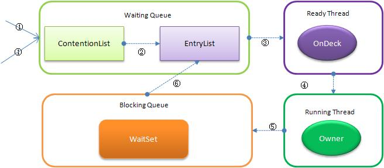
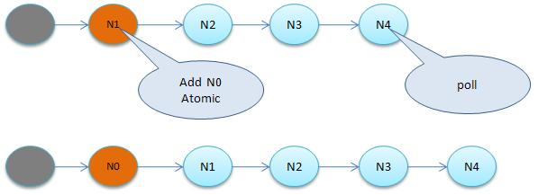

<!-- GFM-TOC -->
* [一、线程状态转换](#一线程状态转换)
    * [新建（New）](#新建new)
    * [可运行（Runnable）](#可运行runnable)
    * [阻塞（Blocking）](#阻塞blocking)
    * [无限期等待（Waiting）](#无限期等待waiting)
    * [限期等待（Timed Waiting）](#限期等待timed-waiting)
    * [死亡（Terminated）](#死亡terminated)
* [二、使用线程](#二使用线程)
    * [实现 Runnable 接口](#实现-runnable-接口)
    * [实现 Callable 接口](#实现-callable-接口)
    * [继承 Thread 类](#继承-thread-类)
    * [实现接口 VS 继承 Thread](#实现接口-vs-继承-thread)
* [三、基础线程机制](#三基础线程机制)
    * [Executor](#executor)
    * [Daemon](#daemon)
    * [sleep()](#sleep)
    * [yield()](#yield)
* [四、中断](#四中断)
    * [InterruptedException](#interruptedexception)
    * [interrupted()](#interrupted)
    * [Executor 的中断操作](#executor-的中断操作)
* [五、互斥同步](#五互斥同步)
    * [synchronized](#synchronized)
    * [ReentrantLock](#reentrantlock)
    * [比较](#比较)
    * [使用选择](#使用选择)
* [六、线程之间的协作](#六线程之间的协作)
    * [join()](#join)
    * [wait() notify() notifyAll()](#wait-notify-notifyall)
    * [await() signal() signalAll()](#await-signal-signalall)
* [七、J.U.C - AQS](#七juc---aqs)
    * [CountdownLatch](#countdownlatch)
    * [CyclicBarrier](#cyclicbarrier)
    * [Semaphore](#semaphore)
* [八、J.U.C - 其它组件](#八juc---其它组件)
    * [FutureTask](#futuretask)
    * [BlockingQueue](#blockingqueue)
    * [ForkJoin](#forkjoin)
* [九、线程不安全示例](#九线程不安全示例)
* [十、Java 内存模型](#十java-内存模型)
    * [主内存与工作内存](#主内存与工作内存)
    * [内存间交互操作](#内存间交互操作)
    * [内存模型三大特性](#内存模型三大特性)
    * [先行发生原则](#先行发生原则)
* [十一、线程安全](#十一线程安全)
    * [不可变](#不可变)
    * [互斥同步](#互斥同步)
    * [非阻塞同步](#非阻塞同步)
    * [无同步方案](#无同步方案)
* [十二、锁优化](#十二锁优化)
    * [自旋锁](#自旋锁)
    * [锁消除](#锁消除)
    * [锁粗化](#锁粗化)
    * [轻量级锁](#轻量级锁)
    * [偏向锁](#偏向锁)
* [十三、多线程开发良好的实践](#十三多线程开发良好的实践)
* [参考资料](#参考资料)
<!-- GFM-TOC -->


# 一、线程状态转换

<div align="center">  </div><br>

## 新建（New）

创建后尚未启动。

## 可运行（Runnable）

可能正在运行，也可能正在等待 CPU 时间片。

包含了操作系统线程状态中的 Running 和 Ready。

## 阻塞（Blocking）

等待获取一个排它锁，如果其线程释放了锁就会结束此状态。

## 无限期等待（Waiting）

等待其它线程显式地唤醒，否则不会被分配 CPU 时间片。

| 进入方法 | 退出方法 |
| --- | --- |
| 没有设置 Timeout 参数的 Object.wait() 方法 | Object.notify() / Object.notifyAll() |
| 没有设置 Timeout 参数的 Thread.join() 方法 | 被调用的线程执行完毕 |
| LockSupport.park() 方法 | - |

## 限期等待（Timed Waiting）

无需等待其它线程显式地唤醒，在一定时间之后会被系统自动唤醒。

调用 Thread.sleep() 方法使线程进入限期等待状态时，常常用“使一个线程睡眠”进行描述。

调用 Object.wait() 方法使线程进入限期等待或者无限期等待时，常常用“挂起一个线程”进行描述。

睡眠和挂起是用来描述行为，而阻塞和等待用来描述状态。

阻塞和等待的区别在于，阻塞是被动的，它是在等待获取一个排它锁。而等待是主动的，通过调用 Thread.sleep() 和 Object.wait() 等方法进入。

| 进入方法 | 退出方法 |
| --- | --- |
| Thread.sleep() 方法 | 时间结束 |
| 设置了 Timeout 参数的 Object.wait() 方法 | 时间结束 / Object.notify() / Object.notifyAll()  |
| 设置了 Timeout 参数的 Thread.join() 方法 | 时间结束 / 被调用的线程执行完毕 |
| LockSupport.parkNanos() 方法 | - |
| LockSupport.parkUntil() 方法 | - |

## 死亡（Terminated）

可以是线程结束任务之后自己结束，或者产生了异常而结束。

# 二、使用线程

有三种使用线程的方法：

- 实现 Runnable 接口；
- 实现 Callable 接口；
- 继承 Thread 类。

实现 Runnable 和 Callable 接口的类只能当做一个可以在线程中运行的任务，不是真正意义上的线程，因此最后还需要通过 Thread 来调用。可以说任务是通过线程驱动从而执行的。

## 实现 Runnable 接口

需要实现 run() 方法。

通过 Thread 调用 start() 方法来启动线程。

```java
public class MyRunnable implements Runnable {
    public void run() {
        // ...
    }
}
```

```java
public static void main(String[] args) {
    MyRunnable instance = new MyRunnable();
    Thread thread = new Thread(instance);
    thread.start();
}
```

## 实现 Callable 接口

与 Runnable 相比，Callable 可以有返回值，返回值通过 FutureTask 进行封装。callable与runnable一样，都是代表抽象的的计算任务，其中的，call方法作用与run一样，但是会返回一个值。Future表示一个任务的生命周期，并提供了相应的方法来判断是否已经完成或取消，以及获取任务的结果。ExecutorService中所有的submit方法都会返回一个future。


```java
public class MyCallable implements Callable<Integer> {
    public Integer call() {
        return 123;
    }
}
```

```java
public static void main(String[] args) throws ExecutionException, InterruptedException {
    MyCallable mc = new MyCallable();
    FutureTask<Integer> ft = new FutureTask<>(mc);
    Thread thread = new Thread(ft);
    thread.start();
    System.out.println(ft.get());
}
```

## 继承 Thread 类

同样也是需要实现 run() 方法，因为 Thread 类也实现了 Runable 接口。

当调用 start() 方法启动一个线程时，虚拟机会将该线程放入就绪队列中等待被调度，当一个线程被调度时会执行该线程的 run() 方法。

```java
public class MyThread extends Thread {
    public void run() {
        // ...
    }
}
```

```java
public static void main(String[] args) {
    MyThread mt = new MyThread();
    mt.start();
}
```

## start()和run()的区别
1. start():
用start方法来启动线程，真正实现了多线程运行，这时无需等待run方法体代码执行完毕而直接继续执行下面的代码。通过调用Thread类的start()方法来启动一个线程，这时，此线程处于就绪(可运行)状态，并没有运行，一旦得到cpu时间片，就开始执行run()方法，这里方法run()称为线程体，它包含了要执行的这个线程的内容， Run方法运行结束，此线程随即终止。

2. run():
run()方法只是类的一个普通方法而已，如果直接调用Run方法，程序中依然只有主线程这一个线程，其程序执行路径还是只有一条，还是要顺序执行，还是要等待run方法体执行完毕后才可继续执行下面的代码，这样就没有达到写线程的目的。

**总结**:调用start方法方可启动线程，而run方法只是thread的一个普通方法调用，还是在主线程里执行。


## Callable和Runnable的区别如下:
1. Callable定义的方法是call，而Runnable定义的方法是run。
2. Callable的call方法可以有返回值，而Runnable的run方法不能有返回值。
3. Callable的call方法可抛出异常，而Runnable的run方法不能抛出异常。


## 实现接口 VS 继承 Thread

实现接口会更好一些，因为：

- Java 不支持多重继承，因此继承了 Thread 类就无法继承其它类，但是可以实现多个接口；
- 类可能只要求可执行就行，继承整个 Thread 类开销过大。

# 三、基础线程机制

## Executor
Java.concurrent下的Executors、 ExecutorServices我们运行一个线程都是显式调用了Thread的start()方法。我们用concurrent下面的类来实现一下线程的运行，而且这将成为以后常用的方法或者实现思路。ExecutorService中有一个execute方法，这个方法的参数是Runnable类型。也就是说，将一个实现了Runnable类型的类的实例作为参数传入execute方法并执行，那么线程就相应的执行了。
ExecuteService继承了Executor， Executor也是一个接口，里面只有一个方法: void execute(Runnable command)。

而ExecuteService中有方法submit，接受Runnable或者Callable任务并返回一个futrue对象

```java
<T> Future<T> submit(Callable<T> task);
<T> Future<T> submit(Runnable task， T result);
```

Executor 管理多个异步任务的执行，而无需程序员显式地管理线程的生命周期。这里的异步是指多个任务的执行互不干扰，不需要进行同步操作。

主要有四种 Executor：

- CachedThreadPool：一个任务创建一个线程，当当前需求小于线程池数量时，将回收一部分线程;若超过了线程池数量，则添加新的线程，线程池的规模不受限制。
- FixedThreadPool：所有任务只能使用固定大小的线程，每提交一个任务就创建一个线程，直到达到最大数量。
- SingleThreadExecutor：相当于大小为 1 的 FixedThreadPool。如果线程异常结束会创建一个新的线程。可以保证任务按照在队列中的顺序来串行执行。
- ScheduledTreadPool：创建固定长度的线程池，且同时以延时或者定时的方法来执行任务。


```java
public static void main(String[] args) {
    ExecutorService executorService = Executors.newCachedThreadPool();
    for (int i = 0; i < 5; i++) {
        executorService.execute(new MyRunnable());
    }
    executorService.shutdown();
}
```
### 线程池的任务队列
线程池对任务队列包括三种:有界队列、无界队列、同步移交。

并发库中的BlockingQueue是一个比较好玩的类，顾名思义，就是阻塞队列。该类主要提供了两个方法put()和take()，前者将一个对象放到队列中，如果队列已经满了，就等待直到有空闲节点:后者从head取一个对象，如果没有对象，就等待直到有可取的对象。FixedThreadPool与SingleThreadPool都是采用无界的linkedBlockingQueue实现。

LinkedBlockingQueue中引入了两把锁takeLock和putLock，显然分别是用于take操作和put。操作的。既LinkedBlockingQueue入队和出队用的是不同的锁，那么LinkedBlockingQueue可以同时进行入队和出队操作。但是由于使用链表实现，所有查找速度回慢一些。
CacheThreadPool使用的是SyncronousQueue。

无界队列：当请求不断增加时队列将无线增加，因此会出现资源耗尽的情况
有界队列:如linkedblockingqueue，Arrayblockingqueue等，可以避免资源耗尽的情况。但是可能会出现队列填满的情况，该如何处理新任务?

执行饱和策略:中止，抛出异常;抛弃:抛齐该任务;调用者运行:将任务返回给调用者。

一般是任务的大小和线程池的大小一起调节。对于非常大的队列或者无界队列，里面的任务可能会长时间排队等待。可以直接使用同步移交交任务直接交给工作者线程执行。

同步移交并不是真正的队列，只是一种线程之间交互的机制。


## Daemon

守护线程是程序运行时在后台提供服务的线程，不属于程序中不可或缺的部分。

当所有非守护线程结束时，程序也就终止，同时会杀死所有守护线程。

main() 属于非守护线程。

使用 setDaemon() 方法将一个线程设置为守护线程。

```java
public static void main(String[] args) {
    Thread thread = new Thread(new MyRunnable());
    thread.setDaemon(true);
}
```

## sleep()

Thread.sleep(millisec) 方法会休眠当前正在执行的线程，millisec 单位为毫秒。

sleep() 可能会抛出 InterruptedException，因为异常不能跨线程传播回 main() 中，因此必须在本地进行处理。线程中抛出的其它异常也同样需要在本地进行处理。

```java
public void run() {
    try {
        Thread.sleep(3000);
    } catch (InterruptedException e) {
        e.printStackTrace();
    }
}
```


## yield()

对静态方法 Thread.yield() 的调用声明了当前线程已经完成了生命周期中最重要的部分，可以切换给其它线程来执行。该方法只是对线程调度器的一个建议，而且也只是建议具有相同优先级的其它线程可以运行。

```java
public void run() {
    Thread.yield();
}
```

# 四、中断

一个线程执行完毕之后会自动结束，如果在运行过程中发生异常也会提前结束。

## InterruptedException

通过调用一个线程的 interrupt() 来中断该线程，如果该线程处于阻塞、限期等待或者无限期等待状态，那么就会抛出 InterruptedException，从而提前结束该线程。但是不能中断 I/O 阻塞和 synchronized 锁阻塞。

对于以下代码，在 main() 中启动一个线程之后再中断它，由于线程中调用了 Thread.sleep() 方法，因此会抛出一个 InterruptedException，从而提前结束线程，不执行之后的语句。

```java
public class InterruptExample {

    private static class MyThread1 extends Thread {
        @Override
        public void run() {
            try {
                Thread.sleep(2000);
                System.out.println("Thread run");
            } catch (InterruptedException e) {
                e.printStackTrace();
            }
        }
    }
}
```

```java
public static void main(String[] args) throws InterruptedException {
    Thread thread1 = new MyThread1();
    thread1.start();
    thread1.interrupt();
    System.out.println("Main run");
}
```

```html
Main run
java.lang.InterruptedException: sleep interrupted
    at java.lang.Thread.sleep(Native Method)
    at InterruptExample.lambda$main$0(InterruptExample.java:5)
    at InterruptExample$$Lambda$1/713338599.run(Unknown Source)
    at java.lang.Thread.run(Thread.java:745)
```

## interrupted()

如果一个线程的 run() 方法执行一个无限循环，并且没有执行 sleep() 等会抛出 InterruptedException 的操作，那么调用线程的 interrupt() 方法就无法使线程提前结束。

但是调用 interrupt() 方法会设置线程的中断标记，此时调用 interrupted() 方法会返回 true。因此可以在循环体中使用 interrupted() 方法来判断线程是否处于中断状态，从而提前结束线程。

```java
public class InterruptExample {

    private static class MyThread2 extends Thread {
        @Override
        public void run() {
            while (!interrupted()) {
                // ..
            }
            System.out.println("Thread end");
        }
    }
}
```

```java
public static void main(String[] args) throws InterruptedException {
    Thread thread2 = new MyThread2();
    thread2.start();
    thread2.interrupt();
}
```

```html
Thread end
```

## Executor 的中断操作

调用 Executor 的 shutdown() 方法会等待线程都执行完毕之后再关闭，但是如果调用的是 shutdownNow() 方法，则相当于调用每个线程的 interrupt() 方法。

以下使用 Lambda 创建线程，相当于创建了一个匿名内部线程。

```java
public static void main(String[] args) {
    ExecutorService executorService = Executors.newCachedThreadPool();
    executorService.execute(() -> {
        try {
            Thread.sleep(2000);
            System.out.println("Thread run");
        } catch (InterruptedException e) {
            e.printStackTrace();
        }
    });
    executorService.shutdownNow();
    System.out.println("Main run");
}
```

```html
Main run
java.lang.InterruptedException: sleep interrupted
    at java.lang.Thread.sleep(Native Method)
    at ExecutorInterruptExample.lambda$main$0(ExecutorInterruptExample.java:9)
    at ExecutorInterruptExample$$Lambda$1/1160460865.run(Unknown Source)
    at java.util.concurrent.ThreadPoolExecutor.runWorker(ThreadPoolExecutor.java:1142)
    at java.util.concurrent.ThreadPoolExecutor$Worker.run(ThreadPoolExecutor.java:617)
    at java.lang.Thread.run(Thread.java:745)
```

如果只想中断 Executor 中的一个线程，可以通过使用 submit() 方法来提交一个线程，它会返回一个 Future<?> 对象，通过调用该对象的 cancel(true) 方法就可以中断线程。

```java
Future<?> future = executorService.submit(() -> {
    // ..
});
future.cancel(true);
```

# 五、互斥同步

Java 提供了两种锁机制来控制多个线程对共享资源的互斥访问，第一个是 JVM 实现的 synchronized，而另一个是 JDK 实现的 ReentrantLock。

## synchronized

**1. 同步一个代码块** 

```java
public void func() {
    synchronized (this) {
        // ...
    }
}
```

它只作用于同一个对象，如果调用两个对象上的同步代码块，就不会进行同步。

对于以下代码，使用 ExecutorService 执行了两个线程，由于调用的是同一个对象的同步代码块，因此这两个线程会进行同步，当一个线程进入同步语句块时，另一个线程就必须等待。

```java
public class SynchronizedExample {

    public void func1() {
        synchronized (this) {
            for (int i = 0; i < 10; i++) {
                System.out.print(i + " ");
            }
        }
    }
}
```

```java
public static void main(String[] args) {
    SynchronizedExample e1 = new SynchronizedExample();
    ExecutorService executorService = Executors.newCachedThreadPool();
    executorService.execute(() -> e1.func1());
    executorService.execute(() -> e1.func1());
}
```

```html
0 1 2 3 4 5 6 7 8 9 0 1 2 3 4 5 6 7 8 9
```

对于以下代码，两个线程调用了不同对象的同步代码块，因此这两个线程就不需要同步。从输出结果可以看出，两个线程交叉执行。

```java
public static void main(String[] args) {
    SynchronizedExample e1 = new SynchronizedExample();
    SynchronizedExample e2 = new SynchronizedExample();
    ExecutorService executorService = Executors.newCachedThreadPool();
    executorService.execute(() -> e1.func1());
    executorService.execute(() -> e2.func1());
}
```

```html
0 0 1 1 2 2 3 3 4 4 5 5 6 6 7 7 8 8 9 9
```


**2. 同步一个方法** 

```java
public synchronized void func () {
    // ...
}
```

它和同步代码块一样，作用于同一个对象。

**3. 同步一个类** 

```java
public void func() {
    synchronized (SynchronizedExample.class) {
        // ...
    }
}
```

作用于整个类，也就是说两个线程调用同一个类的不同对象上的这种同步语句，也会进行同步。

```java
public class SynchronizedExample {

    public void func2() {
        synchronized (SynchronizedExample.class) {
            for (int i = 0; i < 10; i++) {
                System.out.print(i + " ");
            }
        }
    }
}
```

```java
public static void main(String[] args) {
    SynchronizedExample e1 = new SynchronizedExample();
    SynchronizedExample e2 = new SynchronizedExample();
    ExecutorService executorService = Executors.newCachedThreadPool();
    executorService.execute(() -> e1.func2());
    executorService.execute(() -> e2.func2());
}
```

```html
0 1 2 3 4 5 6 7 8 9 0 1 2 3 4 5 6 7 8 9
```

**4. 同步一个静态方法** 

```java
public synchronized static void fun() {
    // ...
}
```

作用于整个类。

## Synchronized实现

synchronized的底层实现主要依靠[Lock-Free的队列](https://coolshell.cn/articles/8239.html)，基本思路是自旋后阻塞，竞争切换后继续竞争锁，稍微牺牲了公平性，但获得了高吞吐量。

synrhronized关键字简洁、清晰、语义明确，因此即使有了Lock接口，使用的还是非常广泛。其应用层的语义是可以把任何一个非null对象 作为"锁"，当synchronized作用在方法上时，锁住的便是对象实例（this）；当作用在静态方法时锁住的便是对象对应的Class实例，因为 Class数据存在于永久带，因此静态方法锁相当于该类的一个全局锁；当synchronized作用于某一个对象实例时，锁住的便是对应的代码块。在 HotSpot JVM实现中，锁有个专门的名字：对象监视器。 

### 线程状态及状态转换

当多个线程同时请求某个对象监视器时，对象监视器会设置几种状态用来区分请求的线程：

Contention List：所有请求锁的线程将被首先放置到该竞争队列

Entry List：Contention List中那些有资格成为候选人的线程被移到Entry List

Wait Set：那些调用wait方法被阻塞的线程被放置到Wait Set

OnDeck：任何时刻最多只能有一个线程正在竞争锁，该线程称为OnDeck

Owner：获得锁的线程称为Owner

!Owner：释放锁的线程

下图反映了个状态转换关系：

<div align="center">  </div><br>

JVM底层又是如何实现synchronized的

新请求锁的线程将首先被加入到ConetentionList中，当某个拥有锁的线程（Owner状态）调用unlock之后，如果发现 EntryList为空则从ContentionList中移动线程到EntryList，下面说明下ContentionList和EntryList 的实现方式：

1. ContentionList 虚拟队列
ContentionList并不是一个真正的Queue，而只是一个虚拟队列，原因在于ContentionList是由Node及其next指 针逻辑构成，并不存在一个Queue的数据结构。ContentionList是一个后进先出（LIFO）的队列，每次新加入Node时都会在队头进行， 通过CAS改变第一个节点的的指针为新增节点，同时设置新增节点的next指向后续节点，而取得操作则发生在队尾。显然，该结构其实是个Lock- Free的队列。

因为只有Owner线程才能从队尾取元素，也即线程出列操作无争用，当然也就避免了CAS的ABA问题。

<div align="center">  </div><br>

2. EntryList

EntryList与ContentionList逻辑上同属等待队列，ContentionList会被线程并发访问，为了降低对 ContentionList队尾的争用，而建立EntryList。Owner线程在unlock时会从ContentionList中迁移线程到 EntryList，并会指定EntryList中的某个线程（一般为Head）为Ready（OnDeck）线程。Owner线程并不是把锁传递给 OnDeck线程，只是把竞争锁的权利交给OnDeck，OnDeck线程需要重新竞争锁。这样做虽然牺牲了一定的公平性，但极大的提高了整体吞吐量，在 Hotspot中把OnDeck的选择行为称之为“竞争切换”。

OnDeck线程获得锁后即变为owner线程，无法获得锁则会依然留在EntryList中，考虑到公平性，在EntryList中的位置不 发生变化（依然在队头）。如果Owner线程被wait方法阻塞，则转移到WaitSet队列；如果在某个时刻被notify/notifyAll唤醒， 则再次转移到EntryList。

被synchronized关键字修饰的代码块在被编译成字节码的时候会在该代码块开始和结束的时候插入monitorenter和moniterexist指令。任何对象都有一个monitor与之关联，当且一个monitor被持有后，它将处于锁定状态。线程执行到monitorenter指令时，将会尝试获取对象所对应的monitor的所有权，即尝试获得对象的锁。虚拟机在执行这两个指令的时候会检查对象的锁状态是否为空或当前线程是否已经拥有该对象锁如果是则将对象锁的计数器加1直接进入同步代码执行。如果不是当前线程就要阻塞等待等到锁释放。

### 自旋锁

那些处于ContetionList、EntryList、WaitSet中的线程均处于阻塞状态，阻塞操作由操作系统完成（在Linxu下通 过pthread_mutex_lock函数）。线程被阻塞后便进入内核（Linux）调度状态，这个会导致系统在用户态与内核态之间来回切换，严重影响 锁的性能

缓解上述问题的办法便是自旋，其原理是：当发生争用时，若Owner线程能在很短的时间内释放锁，则那些正在争用线程可以稍微等一等（自旋）， 在Owner线程释放锁后，争用线程可能会立即得到锁，从而避免了系统阻塞。但Owner运行的时间可能会超出了临界值，争用线程自旋一段时间后还是无法 获得锁，这时争用线程则会停止自旋进入阻塞状态（后退）。基本思路就是自旋，不成功再阻塞，尽量降低阻塞的可能性，这对那些执行时间很短的代码块来说有非 常重要的性能提高。自旋锁有个更贴切的名字：自旋-指数后退锁，也即复合锁。很显然，自旋在多处理器上才有意义。

还有个问题是，线程自旋时做些啥？其实啥都不做，可以执行几次for循环，可以执行几条空的汇编指令，目的是占着CPU不放，等待获取锁的机 会。所以说，自旋是把双刃剑，如果旋的时间过长会影响整体性能，时间过短又达不到延迟阻塞的目的。显然，自旋的周期选择显得非常重要，但这与操作系统、硬 件体系、系统的负载等诸多场景相关，很难选择，如果选择不当，不但性能得不到提高，可能还会下降，因此大家普遍认为自旋锁不具有扩展性。

**自旋优化策略**

对自旋锁周期的选择上，HotSpot认为最佳时间应是一个线程上下文切换的时间，但目前并没有做到。经过调查，目前只是通过汇编暂停了几个CPU周期，除了自旋周期选择，HotSpot还进行许多其他的自旋优化策略，具体如下：

如果平均负载小于CPUs则一直自旋

如果有超过(CPUs/2)个线程正在自旋，则后来线程直接阻塞

如果正在自旋的线程发现Owner发生了变化则延迟自旋时间（自旋计数）或进入阻塞

如果CPU处于节电模式则停止自旋

自旋时间的最坏情况是CPU的存储延迟（CPU A存储了一个数据，到CPU B得知这个数据直接的时间差）

自旋时会适当放弃线程优先级之间的差异

那synchronized实现何时使用了自旋锁？答案是在线程进入ContentionList时，也即第一步操作前。线程在进入等待队列时 首先进行自旋尝试获得锁，如果不成功再进入等待队列。这对那些已经在等待队列中的线程来说，稍微显得不公平。还有一个不公平的地方是自旋线程可能会抢占了 Ready线程的锁。自旋锁由每个监视对象维护，每个监视对象一个。

### JVM1.6偏向锁

在JVM1.6中引入了偏向锁，偏向锁主要解决无竞争下的锁性能问题，首先我们看下无竞争下锁存在什么问题：

现在几乎所有的锁都是可重入的，也即已经获得锁的线程可以多次锁住/解锁监视对象，按照之前的HotSpot设计，每次加锁/解锁都会涉及到一些CAS操 作（比如对等待队列的CAS操作），CAS操作会延迟本地调用，因此偏向锁的想法是一旦线程第一次获得了监视对象，之后让监视对象“偏向”这个 线程，之后的多次调用则可以避免CAS操作，说白了就是置个变量，如果发现为true则无需再走各种加锁/解锁流程。但还有很多概念需要解释、很多引入的 问题需要解决：


### 偏向解除

偏向锁引入的一个重要问题是，在多争用的场景下，如果另外一个线程争用偏向对象，拥有者需要释放偏向锁，而释放的过程会带来一些性能开销，但总体说来偏向锁带来的好处还是大于CAS代价的。


[synchronized的实现](http://www.open-open.com/lib/view/open1352431526366.html)
[锁优化](http://www.cnblogs.com/wade-luffy/p/5969418.html)


## ReentrantLock

ReentrantLock 是 java.util.concurrent（J.U.C）包中的锁。

```java
public class LockExample {

    private Lock lock = new ReentrantLock();

    public void func() {
        lock.lock();
        try {
            for (int i = 0; i < 10; i++) {
                System.out.print(i + " ");
            }
        } finally {
            lock.unlock(); // 确保释放锁，从而避免发生死锁。
        }
    }
}
```

```java
public static void main(String[] args) {
    LockExample lockExample = new LockExample();
    ExecutorService executorService = Executors.newCachedThreadPool();
    executorService.execute(() -> lockExample.func());
    executorService.execute(() -> lockExample.func());
}
```

```html
0 1 2 3 4 5 6 7 8 9 0 1 2 3 4 5 6 7 8 9
```

## 实现
[ReentrantLock实现原理](http://www.cnblogs.com/xrq730/p/4979021.html?utm_source=tuicool&utm_medium=referral)

ReentrantLock是java.util.concurrent。locks中的一个可重入锁类。在高竞争条件下有更好的性能，且可以中断。ReentrantLock是基于AQS (AbstractQueuedSynchronizer)实现的。AQS是基于FIFO队列的实现，整个AQS是典型的模板模式的应用，设计得十分精巧，对于FIFO队列的各种操作在AQS中已经实现了， AQS的子类一般只需要重写tryAcquire(int arg)和tryRelease(int arg)两个方法即可。
ReentrantLock中有一个抽象类Sync继承自AbstractQueuedSynchronizer， ReentrantLock根据传入构造方法的布尔型参数实例化出Sync的实现类FairSync和NonfairSync，分别表示公平的Sync和非公平的Sync。 Sync， FairSync和NonFairSync都是ReentrantLock的静态内部类。Sync是一个抽象类，而FairSync和NonFairSync则是具体类，分别对应了公平锁和非公平锁。由于ReentrantLock我们用的比较多的是非公平锁，所以看下非公平锁是如何实现的。假设线程1调用了ReentrantLock的lock)方法，那么线程1将会独占锁，整个调用链十分简单:

<div align="center">  </div><br>

第一个获取锁的线程就做了两件事情:

1. 设置AbstractQueuedSynchronizer的state为1 (同步状态， 0表示未锁)
2. 设置AbstractOwnableSynchronizer的thread为当前线程(这个是AQS父类，
AbstractOwnableSynchronizer的属性，表示独占模式同步器的当前拥有者)

``` java
final void lock(){
	if (compareAndSetState(0， 1))
		setExclusiveOwnerThread(Thread。currentThread();
	else
		acquire(1);
}
```

3. 当第二个线程想要获取锁时，会执行else，调用acquire方法，进而调用acquire中的tryacquire方法，若果tryacquire返回失败，则将其加入等待队列。

## 使用场景

1. 需要使用可重入锁时，即当该子程序正在运行时，可以再次进入并执行它(并行执行时，个别的执行结果，都符合设计时的预期)
2. 并发竞争很高的情况下
3. 需要使用可中断锁
4. 尝试等待执行:如果发现该操作已经在执行，则尝试等待一段时间，等待超时则不执行
5. 如果发现该操作已经在执行中则不再执行(有状态执行)，例如:用在定时任务时，如果任务执行时间可能超过下次计划执行时间，确保该有状态任务只有一个正在执行，忽略重复触发。


## 比较

**1. 锁的实现** 

synchronized 是 JVM 实现的，而 ReentrantLock 是 JDK 实现的。

synchronized在锁定时如果方法块抛出异常， JVM会自动将锁释放掉，不会因为出了异常没有释放锁造成线程死锁。但是Lock的话就享受不到JVM带来自动的功能，出现异常时必须在finally将锁释放掉，否则将会引起死锁。

**2. 性能** 

新版本 Java 对 synchronized 进行了很多优化，例如自旋锁等，synchronized 与 ReentrantLock 大致相同。

**3. 等待可中断** 

Lock提供一种显示的，可轮询的定时的以及可中断的锁获取操作， synchronize是无法中断一个正在等候获得锁的线程，使用synchronize的线程在等待锁时是不能响应中断的。
轮询锁:当不能同时获得所有的锁时，可以使用轮询锁或者定时锁避免死锁。当一个线程需要获取多个锁时，已获得一部分锁，但是另一部分不可得，此时会返回失败，释放已获得锁，重新尝试获取所有的锁。

**4. 公平锁** 

公平锁是指多个线程在等待同一个锁时，必须按照申请锁的时间顺序来依次获得锁。

synchronized 中的锁是非公平的，ReentrantLock 默认情况下也是非公平的，但是也可以是公平的。

**5. 锁绑定多个条件** 

一个 ReentrantLock 可以同时绑定多个 Condition 对象,可以使用Condition进行线程之间的调度.

Synchronized则使用Object对象本身的notify， wait， notityAll调度机制
Condition是Java5以后出现的机制，它有更好的灵活性，而且在一个对象里面可以有多个Condition (即对象监视器)，则线程可以注册在不同的Condition，从而可以有选择性的调度线程，更加灵活。Synchronized就相当于整个对象只有一个单一的Condition (即该对象本身)所有的线程都注册在它身上，线程调度的时候之后调度所有注册线程，没有选择权，会出现相当大的问题

## 使用选择

除非需要使用 ReentrantLock 的高级功能，否则优先使用 synchronized。这是因为 synchronized 是 JVM 实现的一种锁机制，JVM 原生地支持它，而 ReentrantLock 不是所有的 JDK 版本都支持。并且使用 synchronized 不用担心没有释放锁而导致死锁问题，因为 JVM 会确保锁的释放。

再举个例子:当有多个线程读写文件时，读操作和写操作会发生冲突现象，写操作和写操作会发生冲突现象，但是读操作和读操作不会发生冲突现象。但是采用synchronized关键字来实现同步的话，就会导致一个问题:如果多个线程都只是进行读操作，所以当一个线程在进行读操作时，其他线程只能等待无法进行读操作。因此就需要一种机制来使得多个线程都只是进行读操作时，线程之间不会发生冲突，通过Lock就可以办到。另外，通过Lock可以知道线程有没有成功获取到锁。这个是synchronized无法办到的。


# 六、线程之间的协作

当多个线程可以一起工作去解决某个问题时，如果某些部分必须在其它部分之前完成，那么就需要对线程进行协调。

## join()

在线程中调用另一个线程的 join() 方法，会将当前线程挂起，而不是忙等待，直到目标线程结束。

对于以下代码，虽然 b 线程先启动，但是因为在 b 线程中调用了 a 线程的 join() 方法，b 线程会等待 a 线程结束才继续执行，因此最后能够保证 a 线程的输出先于 b 线程的输出。

```java
public class JoinExample {

    private class A extends Thread {
        @Override
        public void run() {
            System.out.println("A");
        }
    }

    private class B extends Thread {

        private A a;

        B(A a) {
            this.a = a;
        }

        @Override
        public void run() {
            try {
                a.join();
            } catch (InterruptedException e) {
                e.printStackTrace();
            }
            System.out.println("B");
        }
    }

    public void test() {
        A a = new A();
        B b = new B(a);
        b.start();
        a.start();
    }
}
```

```java
public static void main(String[] args) {
    JoinExample example = new JoinExample();
    example.test();
}
```

```
A
B
```

## wait() notify() notifyAll()

调用 wait() 使得线程等待某个条件满足，线程在等待时会被挂起，当其他线程的运行使得这个条件满足时，其它线程会调用 notify() 或者 notifyAll() 来唤醒挂起的线程。

它们都属于 Object 的一部分，而不属于 Thread。

只能用在同步方法或者同步控制块中使用，否则会在运行时抛出 IllegalMonitorStateExeception。

使用 wait() 挂起期间，线程会释放锁。这是因为，如果没有释放锁，那么其它线程就无法进入对象的同步方法或者同步控制块中，那么就无法执行 notify() 或者 notifyAll() 来唤醒挂起的线程，造成死锁。

```java
public class WaitNotifyExample {

    public synchronized void before() {
        System.out.println("before");
        notifyAll();
    }

    public synchronized void after() {
        try {
            wait();
        } catch (InterruptedException e) {
            e.printStackTrace();
        }
        System.out.println("after");
    }
}
```

```java
public static void main(String[] args) {
    ExecutorService executorService = Executors.newCachedThreadPool();
    WaitNotifyExample example = new WaitNotifyExample();
    executorService.execute(() -> example.after());
    executorService.execute(() -> example.before());
}
```

```html
before
after
```

**wait() 和 sleep() 的区别** 

- wait() 是 Object 的方法，而 sleep() 是 Thread 的静态方法；
- wait() 会释放锁，sleep() 不会。

## await() signal() signalAll()

java.util.concurrent 类库中提供了 Condition 类来实现线程之间的协调，可以在 Condition 上调用 await() 方法使线程等待，其它线程调用 signal() 或 signalAll() 方法唤醒等待的线程。

相比于 wait() 这种等待方式，await() 可以指定等待的条件，因此更加灵活。

使用 Lock 来获取一个 Condition 对象。

```java
public class AwaitSignalExample {

    private Lock lock = new ReentrantLock();
    private Condition condition = lock.newCondition();

    public void before() {
        lock.lock();
        try {
            System.out.println("before");
            condition.signalAll();
        } finally {
            lock.unlock();
        }
    }

    public void after() {
        lock.lock();
        try {
            condition.await();
            System.out.println("after");
        } catch (InterruptedException e) {
            e.printStackTrace();
        } finally {
            lock.unlock();
        }
    }
}
```

```java
public static void main(String[] args) {
    ExecutorService executorService = Executors.newCachedThreadPool();
    AwaitSignalExample example = new AwaitSignalExample();
    executorService.execute(() -> example.after());
    executorService.execute(() -> example.before());
}
```

```html
before
after
```

# 七、J.U.C - AQS

java.util.concurrent（J.U.C）大大提高了并发性能，AQS 被认为是 J.U.C 的核心。

## AbstractQueuedSynchronizer (AQS)

提供了一个基于FIFO队列，可以用于构建阻塞锁或者同步容器的基础框架，AQS是基于FIFO队列的实现，因此必然存在一个个节点，Node就是一个节点。对于FIFO队列的各种操作在AQS中已经实现了，AQS的子类一般只需要重写`tryAcquire(int arg)`和`tryRelease(int arg)`两个方法即可。成为依靠单个原子int值来表示状态的大多数同步器的一个有用基础。子类必须定义更改此状态的受保护方法，并定义哪种状态对于此对象意味着被获取或被释放。假定这些条件之后，此类中的其他方法就可以实现所有排队和阻塞机制。

`tryAcquire(int arg)`试图在独占模式下获取对象状态。此方法应该查询是否允许它在独占模式下获取对象状态，如果允许，则获取它。可以用此方法来实现`Lock.tryLock()`方法。`Acquire(int)`以独占模式获取对象，忽略中断。通过至少调用一次`tryAcquire(int)`来实现此方法，并在成功时返回。否则在成功之前，一直调用`tryAcquire(int)`将线程加入队列，线程可能重复被阻塞或不被阻塞。可以使用此方法来实现`Lock.lock()`方法。

tryRelease试图设置状态来反映独占模式下的一个释放。`release(int arg)`以独占模式释放对象。如果`tryRelease(int)`返回true，则通过消除一个或多个线程的阻塞来实现此方法。可以使用此方法来实现Lock.unlock()方法tryAcquireShared(int arg)试图在共享模式下获取对象状态。此方法应该查询是否允许它在共享模式下获取对象状态，如果允许，则获取它。
tryReleaseShared(int arg)试图设置状态来反映共享模式下的一个释放。

## CountdownLatch

用来控制一个线程等待多个线程。

维护了一个计数器 cnt，每次调用 countDown() 方法会让计数器的值减 1，减到 0 的时候，那些因为调用 await() 方法而在等待的线程就会被唤醒。

<div align="center">  </div><br>

```java
public class CountdownLatchExample {
    public static void main(String[] args) throws InterruptedException {
        final int totalThread = 10;
        CountDownLatch countDownLatch = new CountDownLatch(totalThread);
        ExecutorService executorService = Executors.newCachedThreadPool();
        for (int i = 0; i < totalThread; i++) {
            executorService.execute(() -> {
                System.out.print("run..");
                countDownLatch.countDown();
            });
        }
        countDownLatch.await();
        System.out.println("end");
        executorService.shutdown();
    }
}
```

```html
run..run..run..run..run..run..run..run..run..run..end
```

## CyclicBarrier

用来控制多个线程互相等待，只有当多个线程都到达时，这些线程才会继续执行。

和 CountdownLatch 相似，都是通过维护计数器来实现的。线程执行 await() 方法之后计数器会减 1，并进行等待，直到计数器为 0，所有调用 awati() 方法而在等待的线程才能继续执行。

CyclicBarrier 和 CountdownLatch 的一个区别是，CyclicBarrier 的计数器通过调用 reset() 方法可以循环使用，所以它才叫做循环屏障。

CyclicBarrier 有两个构造函数，其中 parties 指示计数器的初始值，barrierAction 在所有线程都到达屏障的时候会执行一次。

```java
public CyclicBarrier(int parties, Runnable barrierAction) {
    if (parties <= 0) throw new IllegalArgumentException();
    this.parties = parties;
    this.count = parties;
    this.barrierCommand = barrierAction;
}

public CyclicBarrier(int parties) {
    this(parties, null);
}
```

<div align="center">  </div><br>

```java
public class CyclicBarrierExample {
    public static void main(String[] args) {
        final int totalThread = 10;
        CyclicBarrier cyclicBarrier = new CyclicBarrier(totalThread);
        ExecutorService executorService = Executors.newCachedThreadPool();
        for (int i = 0; i < totalThread; i++) {
            executorService.execute(() -> {
                System.out.print("before..");
                try {
                    cyclicBarrier.await();
                } catch (InterruptedException | BrokenBarrierException e) {
                    e.printStackTrace();
                }
                System.out.print("after..");
            });
        }
        executorService.shutdown();
    }
}
```

```html
before..before..before..before..before..before..before..before..before..before..after..after..after..after..after..after..after..after..after..after..
```

### CountDownLatch和CyclicBarrier的区别
1. CyclicBarrier的某个线程运行到某个点上之后，该线程即停止运行，直到所有的线程都到达了这个点，所有线程才重新运行；CountDownLatch则不是，某线程运行到某个点上之后，只是给某个数值-1而已，该线程继续运行
2. CyclicBarrier只能唤起一个任务，CountDownLatch可以唤起多个任务
3. CyclicBarrier可重用，CountDownLatch不可重用，计数值为0该CountDownLatch就不可再用了


## Semaphore

Semaphore 类似于操作系统中的信号量，可以控制对互斥资源的访问线程数。

<div align="center">  </div><br>

以下代码模拟了对某个服务的并发请求，每次只能有 3 个客户端同时访问，请求总数为 10。

```java
public class SemaphoreExample {
    public static void main(String[] args) {
        final int clientCount = 3;
        final int totalRequestCount = 10;
        Semaphore semaphore = new Semaphore(clientCount);
        ExecutorService executorService = Executors.newCachedThreadPool();
        for (int i = 0; i < totalRequestCount; i++) {
            executorService.execute(()->{
                try {
                    semaphore.acquire();
                    System.out.print(semaphore.availablePermits() + " ");
                } catch (InterruptedException e) {
                    e.printStackTrace();
                } finally {
                    semaphore.release();
                }
            });
        }
        executorService.shutdown();
    }
}
```

```html
2 1 2 2 2 2 2 1 2 2
```

# 八、J.U.C - 其它组件

## ReadWriteLock

ReentrantLock某些时候有局限。如果使用ReentrantLock，可能本身是为了防止线程A在写数据、线程B在读数据造成的数据不一致，但这样，如果线程C在读数据、线程D也在读数据，读数据是不会改变数据的，没有必要加锁，但是还是加锁了，降低了程序的性能。

ReadWriteLock是一个读写锁接口，ReentrantReadWriteLock是ReadWriteLock接口的一个具体实现，实现了读写的分离，读锁是共享的，写锁是独占的，读和读之间不会互斥，读和写、写和读、写和写之间才会互斥，提升了读写的性能。
[ReadWriteLock原理](https://blog.csdn.net/qq_19431333/article/details/70568478)

## FutureTask

在介绍 Callable 时我们知道它可以有返回值，返回值通过 Future<V> 进行封装。FutureTask 实现了 RunnableFuture 接口，该接口继承自 Runnable 和 Future<V> 接口，这使得 FutureTask 既可以当做一个任务执行，也可以有返回值。

```java
public class FutureTask<V> implements RunnableFuture<V>
```

```java
public interface RunnableFuture<V> extends Runnable, Future<V>
```

FutureTask 可用于异步获取执行结果或取消执行任务的场景。当一个计算任务需要执行很长时间，那么就可以用 FutureTask 来封装这个任务，主线程在完成自己的任务之后再去获取结果。

```java
public class FutureTaskExample {
    public static void main(String[] args) throws ExecutionException, InterruptedException {
        FutureTask<Integer> futureTask = new FutureTask<Integer>(new Callable<Integer>() {
            @Override
            public Integer call() throws Exception {
                int result = 0;
                for (int i = 0; i < 100; i++) {
                    Thread.sleep(10);
                    result += i;
                }
                return result;
            }
        });

        Thread computeThread = new Thread(futureTask);
        computeThread.start();

        Thread otherThread = new Thread(() -> {
            System.out.println("other task is running...");
            try {
                Thread.sleep(1000);
            } catch (InterruptedException e) {
                e.printStackTrace();
            }
        });
        otherThread.start();
        System.out.println(futureTask.get());
    }
}
```

```html
other task is running...
4950
```

## BlockingQueue

java.util.concurrent.BlockingQueue 接口有以下阻塞队列的实现：

-  **FIFO 队列** ：LinkedBlockingQueue、ArrayBlockingQueue（固定长度）
-  **优先级队列** ：PriorityBlockingQueue

提供了阻塞的 take() 和 put() 方法：如果队列为空 take() 将阻塞，直到队列中有内容；如果队列为满 put() 将阻塞，直到队列有空闲位置。

**使用 BlockingQueue 实现生产者消费者问题** 

```java
public class ProducerConsumer {

    private static BlockingQueue<String> queue = new ArrayBlockingQueue<>(5);

    private static class Producer extends Thread {
        @Override
        public void run() {
            try {
                queue.put("product");
            } catch (InterruptedException e) {
                e.printStackTrace();
            }
            System.out.print("produce..");
        }
    }

    private static class Consumer extends Thread {

        @Override
        public void run() {
            try {
                String product = queue.take();
            } catch (InterruptedException e) {
                e.printStackTrace();
            }
            System.out.print("consume..");
        }
    }
}
```

```java
public static void main(String[] args) {
    for (int i = 0; i < 2; i++) {
        Producer producer = new Producer();
        producer.start();
    }
    for (int i = 0; i < 5; i++) {
        Consumer consumer = new Consumer();
        consumer.start();
    }
    for (int i = 0; i < 3; i++) {
        Producer producer = new Producer();
        producer.start();
    }
}
```

```html
produce..produce..consume..consume..produce..consume..produce..consume..produce..consume..
```

## ForkJoin

主要用于并行计算中，和 MapReduce 原理类似，都是把大的计算任务拆分成多个小任务并行计算。

```java
public class ForkJoinExample extends RecursiveTask<Integer> {
    private final int threshold = 5;
    private int first;
    private int last;

    public ForkJoinExample(int first, int last) {
        this.first = first;
        this.last = last;
    }

    @Override
    protected Integer compute() {
        int result = 0;
        if (last - first <= threshold) {
            // 任务足够小则直接计算
            for (int i = first; i <= last; i++) {
                result += i;
            }
        } else {
            // 拆分成小任务
            int middle = first + (last - first) / 2;
            ForkJoinExample leftTask = new ForkJoinExample(first, middle);
            ForkJoinExample rightTask = new ForkJoinExample(middle + 1, last);
            leftTask.fork();
            rightTask.fork();
            result = leftTask.join() + rightTask.join();
        }
        return result;
    }
}
```

```java
public static void main(String[] args) throws ExecutionException, InterruptedException {
    ForkJoinExample example = new ForkJoinExample(1, 10000);
    ForkJoinPool forkJoinPool = new ForkJoinPool();
    Future result = forkJoinPool.submit(example);
    System.out.println(result.get());
}
```

ForkJoin 使用 ForkJoinPool 来启动，它是一个特殊的线程池，线程数量取决于 CPU 核数。

```java
public class ForkJoinPool extends AbstractExecutorService
```

ForkJoinPool 实现了工作窃取算法来提高 CPU 的利用率。每个线程都维护了一个双端队列，用来存储需要执行的任务。工作窃取算法允许空闲的线程从其它线程的双端队列中窃取一个任务来执行。窃取的任务必须是最晚的任务，避免和队列所属线程发生竞争。例如下图中，Thread2 从 Thread1 的队列中拿出最晚的 Task1 任务，Thread1 会拿出 Task2 来执行，这样就避免发生竞争。但是如果队列中只有一个任务时还是会发生竞争。

<div align="center">  </div><br>

# 九、线程不安全示例

如果多个线程对同一个共享数据进行访问而不采取同步操作的话，那么操作的结果是不一致的。

以下代码演示了 1000 个线程同时对 cnt 执行自增操作，操作结束之后它的值有可能小于 1000。

```java
public class ThreadUnsafeExample {

    private int cnt = 0;

    public void add() {
        cnt++;
    }

    public int get() {
        return cnt;
    }
}
```

```java
public static void main(String[] args) throws InterruptedException {
    final int threadSize = 1000;
    ThreadUnsafeExample example = new ThreadUnsafeExample();
    final CountDownLatch countDownLatch = new CountDownLatch(threadSize);
    ExecutorService executorService = Executors.newCachedThreadPool();
    for (int i = 0; i < threadSize; i++) {
        executorService.execute(() -> {
            example.add();
            countDownLatch.countDown();
        });
    }
    countDownLatch.await();
    executorService.shutdown();
    System.out.println(example.get());
}
```

```html
997
```

# 十、Java 内存模型

Java 内存模型试图屏蔽各种硬件和操作系统的内存访问差异，以实现让 Java 程序在各种平台下都能达到一致的内存访问效果。

## 主内存与工作内存

处理器上的寄存器的读写的速度比内存快几个数量级，为了解决这种速度矛盾，在它们之间加入了高速缓存。

加入高速缓存带来了一个新的问题：缓存一致性。如果多个缓存共享同一块主内存区域，那么多个缓存的数据可能会不一致，需要一些协议来解决这个问题。

<div align="center">  </div><br>

所有的变量都存储在主内存中，每个线程还有自己的工作内存，工作内存存储在高速缓存或者寄存器中，保存了该线程使用的变量的主内存副本拷贝。

线程只能直接操作工作内存中的变量，不同线程之间的变量值传递需要通过主内存来完成。

<div align="center">  </div><br>

## 内存间交互操作

Java 内存模型定义了 8 个操作来完成主内存和工作内存的交互操作。

<div align="center">  </div><br>

- read：把一个变量的值从主内存传输到工作内存中
- load：在 read 之后执行，把 read 得到的值放入工作内存的变量副本中
- use：把工作内存中一个变量的值传递给执行引擎
- assign：把一个从执行引擎接收到的值赋给工作内存的变量
- store：把工作内存的一个变量的值传送到主内存中
- write：在 store 之后执行，把 store 得到的值放入主内存的变量中
- lock：作用于主内存的变量
- unlock

## 内存模型三大特性

### 1. 原子性

Java 内存模型保证了 read、load、use、assign、store、write、lock 和 unlock 操作具有原子性，例如对一个 int 类型的变量执行 assign 赋值操作，这个操作就是原子性的。但是 Java 内存模型允许虚拟机将没有被 volatile 修饰的 64 位数据（long，double）的读写操作划分为两次 32 位的操作来进行，即 load、store、read 和 write 操作可以不具备原子性。

有一个错误认识就是，int 等原子性的类型在多线程环境中不会出现线程安全问题。前面的线程不安全示例代码中，cnt 属于 int 类型变量，1000 个线程对它进行自增操作之后，得到的值为 997 而不是 1000。

为了方便讨论，将内存间的交互操作简化为 3 个：load、assign、store。

下图演示了两个线程同时对 cnt 进行操作，load、assign、store 这一系列操作整体上看不具备原子性，那么在 T1 修改 cnt 并且还没有将修改后的值写入主内存，T2 依然可以读入旧值。可以看出，这两个线程虽然执行了两次自增运算，但是主内存中 cnt 的值最后为 1 而不是 2。因此对 int 类型读写操作满足原子性只是说明 load、assign、store 这些单个操作具备原子性。

<div align="center">  </div><br>

AtomicInteger 能保证多个线程修改的原子性。

<div align="center">  </div><br>

使用 AtomicInteger 重写之前线程不安全的代码之后得到以下线程安全实现：

```java
public class AtomicExample {
    private AtomicInteger cnt = new AtomicInteger();

    public void add() {
        cnt.incrementAndGet();
    }

    public int get() {
        return cnt.get();
    }
}
```

```java
public static void main(String[] args) throws InterruptedException {
    final int threadSize = 1000;
    AtomicExample example = new AtomicExample(); // 只修改这条语句
    final CountDownLatch countDownLatch = new CountDownLatch(threadSize);
    ExecutorService executorService = Executors.newCachedThreadPool();
    for (int i = 0; i < threadSize; i++) {
        executorService.execute(() -> {
            example.add();
            countDownLatch.countDown();
        });
    }
    countDownLatch.await();
    executorService.shutdown();
    System.out.println(example.get());
}
```

```html
1000
```

除了使用原子类之外，也可以使用 synchronized 互斥锁来保证操作的原子性。它对应的内存间交互操作为：lock 和 unlock，在虚拟机实现上对应的字节码指令为 monitorenter 和 monitorexit。

```java
public class AtomicSynchronizedExample {
    private int cnt = 0;

    public synchronized void add() {
        cnt++;
    }

    public synchronized int get() {
        return cnt;
    }
}
```

```java
public static void main(String[] args) throws InterruptedException {
    final int threadSize = 1000;
    AtomicSynchronizedExample example = new AtomicSynchronizedExample();
    final CountDownLatch countDownLatch = new CountDownLatch(threadSize);
    ExecutorService executorService = Executors.newCachedThreadPool();
    for (int i = 0; i < threadSize; i++) {
        executorService.execute(() -> {
            example.add();
            countDownLatch.countDown();
        });
    }
    countDownLatch.await();
    executorService.shutdown();
    System.out.println(example.get());
}
```

```html
1000
```

### 2. 可见性

可见性指当一个线程修改了共享变量的值，其它线程能够立即得知这个修改。Java 内存模型是通过在变量修改后将新值同步回主内存，在变量读取前从主内存刷新变量值来实现可见性的。

主要有有三种实现可见性的方式：

- volatile
- synchronized，对一个变量执行 unlock 操作之前，必须把变量值同步回主内存。
- final，被 final 关键字修饰的字段在构造器中一旦初始化完成，并且没有发生 this 逃逸（其它线程通过 this 引用访问到初始化了一半的对象），那么其它线程就能看见 final 字段的值。

对前面的线程不安全示例中的 cnt 变量使用 volatile 修饰，不能解决线程不安全问题，因为 volatile 并不能保证操作的原子性。

### 3. 有序性

有序性是指：在本线程内观察，所有操作都是有序的。在一个线程观察另一个线程，所有操作都是无序的，无序是因为发生了指令重排序。在 Java 内存模型中，允许编译器和处理器对指令进行重排序，重排序过程不会影响到单线程程序的执行，却会影响到多线程并发执行的正确性。

volatile 关键字通过添加内存屏障的方式来禁止指令重排，即重排序时不能把后面的指令放到内存屏障之前。

也可以通过 synchronized 来保证有序性，它保证每个时刻只有一个线程执行同步代码，相当于是让线程顺序执行同步代码。

## 先行发生原则

上面提到了可以用 volatile 和 synchronized 来保证有序性。除此之外，JVM 还规定了先行发生原则，让一个操作无需控制就能先于另一个操作完成。

### 1. 单一线程原则

> Single Thread rule

在一个线程内，在程序前面的操作先行发生于后面的操作。

<div align="center">  </div><br>

### 2. 管程锁定规则

> Monitor Lock Rule

一个 unlock 操作先行发生于后面对同一个锁的 lock 操作。

<div align="center">  </div><br>

### 3. volatile 变量规则

> Volatile Variable Rule

对一个 volatile 变量的写操作先行发生于后面对这个变量的读操作。

<div align="center">  </div><br>

### 4. 线程启动规则

> Thread Start Rule

Thread 对象的 start() 方法调用先行发生于此线程的每一个动作。

<div align="center">  </div><br>

### 5. 线程加入规则

> Thread Join Rule

Thread 对象的结束先行发生于 join() 方法返回。

<div align="center">  </div><br>

### 6. 线程中断规则

> Thread Interruption Rule

对线程 interrupt() 方法的调用先行发生于被中断线程的代码检测到中断事件的发生，可以通过 interrupted() 方法检测到是否有中断发生。

### 7. 对象终结规则

> Finalizer Rule

一个对象的初始化完成（构造函数执行结束）先行发生于它的 finalize() 方法的开始。

### 8. 传递性

> Transitivity

如果操作 A 先行发生于操作 B，操作 B 先行发生于操作 C，那么操作 A 先行发生于操作 C。

# 十一、线程安全

多个线程不管以何种方式访问某个类，并在在主调代码中不需要进行同步，都能表现正确的行为。

线程安全有以下几种实现方式：

## 不可变

不可变（Immutable）的对象一定是线程安全的，不需要再采取任何的线程安全保障措施。只要一个不可变的对象被正确地构建出来，永远也不会看到它在多个线程之中处于不一致的状态。多线程环境下，应当尽量使对象成为不可变，来满足线程安全。

不可变的类型：

- final 关键字修饰的基本数据类型
- String
- 枚举类型
- Number 部分子类，如 Long 和 Double 等数值包装类型，BigInteger 和 BigDecimal 等大数据类型。但同为 Number 的原子类 AtomicInteger 和 AtomicLong 则是可变的。

对于集合类型，可以使用 Collections.unmodifiableXXX() 方法来获取一个不可变的集合。

```java
public class ImmutableExample {
    public static void main(String[] args) {
        Map<String, Integer> map = new HashMap<>();
        Map<String, Integer> unmodifiableMap = Collections.unmodifiableMap(map);
        unmodifiableMap.put("a", 1);
    }
}
```

```html
Exception in thread "main" java.lang.UnsupportedOperationException
    at java.util.Collections$UnmodifiableMap.put(Collections.java:1457)
    at ImmutableExample.main(ImmutableExample.java:9)
```

Collections.unmodifiableXXX() 先对原始的集合进行拷贝，需要对集合进行修改的方法都直接抛出异常。

```java
public V put(K key, V value) {
    throw new UnsupportedOperationException();
}
```

## 互斥同步

synchronized 和 ReentrantLock。

## 非阻塞同步

互斥同步最主要的问题就是线程阻塞和唤醒所带来的性能问题，因此这种同步也称为阻塞同步。

互斥同步属于一种悲观的并发策略，总是认为只要不去做正确的同步措施，那就肯定会出现问题。无论共享数据是否真的会出现竞争，它都要进行加锁（这里讨论的是概念模型，实际上虚拟机会优化掉很大一部分不必要的加锁）、用户态核心态转换、维护锁计数器和检查是否有被阻塞的线程需要唤醒等操作。

### 1. CAS

随着硬件指令集的发展，我们可以使用基于冲突检测的乐观并发策略：先进行操作，如果没有其它线程争用共享数据，那操作就成功了，否则采取补偿措施（不断地重试，直到成功为止）。这种乐观的并发策略的许多实现都不需要将线程阻塞，因此这种同步操作称为非阻塞同步。

乐观锁需要操作和冲突检测这两个步骤具备原子性，这里就不能再使用互斥同步来保证了，只能靠硬件来完成。硬件支持的原子性操作最典型的是：比较并交换（Compare-and-Swap，CAS）。CAS 指令需要有 3 个操作数，分别是内存地址 V、旧的预期值 A 和新值 B。当执行操作时，只有当 V 的值等于 A，才将 V 的值更新为 B。

#### CAS及SMP架构

CAS为什么会引入本地延迟？这要从SMP（对称多处理器）架构说起，下图大概表明了SMP的结构：

<div align="center">  </div><br>

其意思是所有的CPU会共享一条系统总线（BUS），靠此总线连接主存。每个核都有自己的一级缓存，各核相对于BUS对称分布，因此这种结构称为“对称多处理器”。

而CAS的全称为Compare-And-Swap，是一条CPU的原子指令，其作用是让CPU比较后原子地更新某个位置的值，经过调查发现， 其实现方式是基于硬件平台的汇编指令，就是说CAS是靠硬件实现的，JVM只是封装了汇编调用，那些AtomicInteger类便是使用了这些封装后的 接口。

Core1和Core2可能会同时把主存中某个位置的值Load到自己的L1 Cache中，当Core1在自己的L1 Cache中修改这个位置的值时，会通过总线，使Core2中L1 Cache对应的值“失效”，而Core2一旦发现自己L1 Cache中的值失效（称为Cache命中缺失）则会通过总线从内存中加载该地址最新的值，大家通过总线的来回通信称为“Cache一致性流量”，因为总 线被设计为固定的“通信能力”，如果Cache一致性流量过大，总线将成为瓶颈。而当Core1和Core2中的值再次一致时，称为“Cache一致 性”，从这个层面来说，锁设计的终极目标便是减少Cache一致性流量。

而CAS恰好会导致Cache一致性流量，如果有很多线程都共享同一个对象，当某个Core CAS成功时必然会引起总线风暴，这就是所谓的本地延迟，本质上偏向锁就是为了消除CAS，降低Cache一致性流量。

**Cache一致性：**

上面提到Cache一致性，其实是有协议支持的，现在通用的协议是MESI（最早由Intel开始支持），具体参考：http://en.wikipedia.org/wiki/MESI_protocol，以后会仔细讲解这部分。

**Cache一致性流量的例外情况：**

其实也不是所有的CAS都会导致总线风暴，这跟Cache一致性协议有关，具体参考：http://blogs.oracle.com/dave/entry/biased_locking_in_hotspot

NUMA(Non Uniform Memory Access Achitecture）架构：

与SMP对应还有非对称多处理器架构，现在主要应用在一些高端处理器上，主要特点是没有总线，没有公用主存，每个Core有自己的内存，针对这种结构此处不做讨论。

### 2. AtomicInteger


J.U.C 包里面的整数原子类 AtomicInteger 的方法调用了 [Unsafe 类的 CAS 操作](http://www.cnblogs.com/xrq730/p/4976007.html)。

以下代码使用了 AtomicInteger 执行了自增的操作。

```java
private AtomicInteger cnt = new AtomicInteger();

public void add() {
    cnt.incrementAndGet();
}
```

以下代码是 incrementAndGet() 的源码，它调用了 Unsafe 的 getAndAddInt() 。

```java
public final int incrementAndGet() {
    return unsafe.getAndAddInt(this, valueOffset, 1) + 1;
}
```

以下代码是 getAndAddInt() 源码，var1 指示对象内存地址，var2 指示该字段相对对象内存地址的偏移，var4 指示操作需要加的数值，这里为 1。通过 getIntVolatile(var1, var2) 得到旧的预期值，通过调用 compareAndSwapInt() 来进行 CAS 比较，如果该字段内存地址中的值等于 var5，那么就更新内存地址为 var1+var2 的变量为 var5+var4。

可以看到 getAndAddInt() 在一个循环中进行，发生冲突的做法是不断的进行重试。

```java
public final int getAndAddInt(Object var1, long var2, int var4) {
    int var5;
    do {
        var5 = this.getIntVolatile(var1, var2);
    } while(!this.compareAndSwapInt(var1, var2, var5, var5 + var4));

    return var5;
}
```

### 3. ABA

如果一个变量初次读取的时候是 A 值，它的值被改成了 B，后来又被改回为 A，那 CAS 操作就会误认为它从来没有被改变过。

J.U.C 包提供了一个带有标记的原子引用类 AtomicStampedReference 来解决这个问题，它可以通过控制变量值的版本来保证 CAS 的正确性。大部分情况下 ABA 问题不会影响程序并发的正确性，如果需要解决 ABA 问题，改用传统的互斥同步可能会比原子类更高效。

## 无同步方案

要保证线程安全，并不是一定就要进行同步。如果一个方法本来就不涉及共享数据，那它自然就无须任何同步措施去保证正确性。

### 1. 栈封闭

多个线程访问同一个方法的局部变量时，不会出现线程安全问题，因为局部变量存储在虚拟机栈中，属于线程私有的。

```java
public class StackClosedExample {
    public void add100() {
        int cnt = 0;
        for (int i = 0; i < 100; i++) {
            cnt++;
        }
        System.out.println(cnt);
    }
}
```

```java
public static void main(String[] args) {
    StackClosedExample example = new StackClosedExample();
    ExecutorService executorService = Executors.newCachedThreadPool();
    executorService.execute(() -> example.add100());
    executorService.execute(() -> example.add100());
    executorService.shutdown();
}
```

```html
100
100
```

### 2. 线程本地存储（Thread Local Storage）

如果一段代码中所需要的数据必须与其他代码共享，那就看看这些共享数据的代码是否能保证在同一个线程中执行。如果能保证，我们就可以把共享数据的可见范围限制在同一个线程之内，这样，无须同步也能保证线程之间不出现数据争用的问题。

符合这种特点的应用并不少见，大部分使用消费队列的架构模式（如“生产者-消费者”模式）都会将产品的消费过程尽量在一个线程中消费完。其中最重要的一个应用实例就是经典 Web 交互模型中的“一个请求对应一个服务器线程”（Thread-per-Request）的处理方式，这种处理方式的广泛应用使得很多 Web 服务端应用都可以使用线程本地存储来解决线程安全问题。

可以使用 java.lang.ThreadLocal 类来实现线程本地存储功能。

对于以下代码，thread1 中设置 threadLocal 为 1，而 thread2 设置 threadLocal 为 2。过了一段时间之后，thread1 读取 threadLocal 依然是 1，不受 thread2 的影响。

```java
public class ThreadLocalExample {
    public static void main(String[] args) {
        ThreadLocal threadLocal = new ThreadLocal();
        Thread thread1 = new Thread(() -> {
            threadLocal.set(1);
            try {
                Thread.sleep(1000);
            } catch (InterruptedException e) {
                e.printStackTrace();
            }
            System.out.println(threadLocal.get());
            threadLocal.remove();
        });
        Thread thread2 = new Thread(() -> {
            threadLocal.set(2);
            threadLocal.remove();
        });
        thread1.start();
        thread2.start();
    }
}
```

```html
1
```

为了理解 ThreadLocal，先看以下代码：

```java
public class ThreadLocalExample1 {
    public static void main(String[] args) {
        ThreadLocal threadLocal1 = new ThreadLocal();
        ThreadLocal threadLocal2 = new ThreadLocal();
        Thread thread1 = new Thread(() -> {
            threadLocal1.set(1);
            threadLocal2.set(1);
        });
        Thread thread2 = new Thread(() -> {
            threadLocal1.set(2);
            threadLocal2.set(2);
        });
        thread1.start();
        thread2.start();
    }
}
```

它所对应的底层结构图为：

<div align="center">  </div><br>

每个 Thread 都有一个 ThreadLocal.ThreadLocalMap 对象。

```java
/* ThreadLocal values pertaining to this thread. This map is maintained
 * by the ThreadLocal class. */
ThreadLocal.ThreadLocalMap threadLocals = null;
```

当调用一个 ThreadLocal 的 set(T value) 方法时，先得到当前线程的 ThreadLocalMap 对象，然后将 ThreadLocal->value 键值对插入到该 Map 中。

```java
public void set(T value) {
    Thread t = Thread.currentThread();
    ThreadLocalMap map = getMap(t);
    if (map != null)
        map.set(this, value);
    else
        createMap(t, value);
}
```

get() 方法类似。

```java
public T get() {
    Thread t = Thread.currentThread();
    ThreadLocalMap map = getMap(t);
    if (map != null) {
        ThreadLocalMap.Entry e = map.getEntry(this);
        if (e != null) {
            @SuppressWarnings("unchecked")
            T result = (T)e.value;
            return result;
        }
    }
    return setInitialValue();
}
```

ThreadLocal 从理论上讲并不是用来解决多线程并发问题的，因为根本不存在多线程竞争。

在一些场景 (尤其是使用线程池) 下，由于 ThreadLocal.ThreadLocalMap 的底层数据结构导致 ThreadLocal 有内存泄漏的情况，应该尽可能在每次使用 ThreadLocal 后手动调用 remove()，以避免出现 ThreadLocal 经典的内存泄漏甚至是造成自身业务混乱的风险。

### 3. 可重入代码（Reentrant Code）

这种代码也叫做纯代码（Pure Code），可以在代码执行的任何时刻中断它，转而去执行另外一段代码（包括递归调用它本身），而在控制权返回后，原来的程序不会出现任何错误。

可重入代码有一些共同的特征，例如不依赖存储在堆上的数据和公用的系统资源、用到的状态量都由参数中传入、不调用非可重入的方法等。

# 十二、锁优化

这里的锁优化主要是指 JVM 对 synchronized 的优化。

## 自旋锁

互斥同步进入阻塞状态的开销都很大，应该尽量避免。在许多应用中，共享数据的锁定状态只会持续很短的一段时间。自旋锁的思想是让一个线程在请求一个共享数据的锁时执行忙循环（自旋）一段时间，如果在这段时间内能获得锁，就可以避免进入阻塞状态。

自旋锁虽然能避免进入阻塞状态从而减少开销，但是它需要进行忙循环操作占用 CPU 时间，它只适用于共享数据的锁定状态很短的场景。

在 JDK 1.6 中引入了自适应的自旋锁。自适应意味着自旋的次数不再固定了，而是由前一次在同一个锁上的自旋次数及锁的拥有者的状态来决定。

## 锁消除

锁消除是指对于被检测出不可能存在竞争的共享数据的锁进行消除。

锁消除主要是通过逃逸分析来支持，如果堆上的共享数据不可能逃逸出去被其它线程访问到，那么就可以把它们当成私有数据对待，也就可以将它们的锁进行消除。

对于一些看起来没有加锁的代码，其实隐式的加了很多锁。例如下面的字符串拼接代码就隐式加了锁：

```java
public static String concatString(String s1, String s2, String s3) {
    return s1 + s2 + s3;
}
```

String 是一个不可变的类，编译器会对 String 的拼接自动优化。在 JDK 1.5 之前，会转化为 StringBuffer 对象的连续 append() 操作：

```java
public static String concatString(String s1, String s2, String s3) {
    StringBuffer sb = new StringBuffer();
    sb.append(s1);
    sb.append(s2);
    sb.append(s3);
    return sb.toString();
}
```

每个 append() 方法中都有一个同步块。虚拟机观察变量 sb，很快就会发现它的动态作用域被限制在 concatString() 方法内部。也就是说，sb 的所有引用永远不会逃逸到 concatString() 方法之外，其他线程无法访问到它，因此可以进行消除。

## 锁粗化

如果一系列的连续操作都对同一个对象反复加锁和解锁，频繁的加锁操作就会导致性能损耗。

上一节的示例代码中连续的 append() 方法就属于这类情况。如果虚拟机探测到由这样的一串零碎的操作都对同一个对象加锁，将会把加锁的范围扩展（粗化）到整个操作序列的外部。对于上一节的示例代码就是扩展到第一个 append() 操作之前直至最后一个 append() 操作之后，这样只需要加锁一次就可以了。

## 轻量级锁

JDK 1.6 引入了偏向锁和轻量级锁，从而让锁拥有了四个状态：无锁状态（unlocked）、偏向锁状态（biasble）、轻量级锁状态（lightweight locked）和重量级锁状态（inflated）。

以下是 HotSpot 虚拟机对象头的内存布局，这些数据被称为 Mark Word。其中 tag bits 对应了五个状态，这些状态在右侧的 state 表格中给出。除了 marked for gc 状态，其它四个状态已经在前面介绍过了。

<div align="center">  </div><br>

下图左侧是一个线程的虚拟机栈，其中有一部分称为 Lock Record 的区域，这是在轻量级锁运行过程创建的，用于存放锁对象的 Mark Word。而右侧就是一个锁对象，包含了 Mark Word 和其它信息。

<div align="center">  </div><br>

轻量级锁是相对于传统的重量级锁而言，它使用 CAS 操作来避免重量级锁使用互斥量的开销。对于绝大部分的锁，在整个同步周期内都是不存在竞争的，因此也就不需要都使用互斥量进行同步，可以先采用 CAS 操作进行同步，如果 CAS 失败了再改用互斥量进行同步。

当尝试获取一个锁对象时，如果锁对象标记为 0 01，说明锁对象的锁未锁定（unlocked）状态。此时虚拟机在当前线程的虚拟机栈中创建 Lock Record，然后使用 CAS 操作将对象的 Mark Word 更新为 Lock Record 指针。如果 CAS 操作成功了，那么线程就获取了该对象上的锁，并且对象的 Mark Word 的锁标记变为 00，表示该对象处于轻量级锁状态。

<div align="center">  </div><br>

如果 CAS 操作失败了，虚拟机首先会检查对象的 Mark Word 是否指向当前线程的虚拟机栈，如果是的话说明当前线程已经拥有了这个锁对象，那就可以直接进入同步块继续执行，否则说明这个锁对象已经被其他线程线程抢占了。如果有两条以上的线程争用同一个锁，那轻量级锁就不再有效，要膨胀为重量级锁。

## 偏向锁

偏向锁的思想是偏向于让第一个获取锁对象的线程，这个线程在之后获取该锁就不再需要进行同步操作，甚至连 CAS 操作也不再需要。

当锁对象第一次被线程获得的时候，进入偏向状态，标记为 1 01。同时使用 CAS 操作将线程 ID 记录到 Mark Word 中，如果 CAS 操作成功，这个线程以后每次进入这个锁相关的同步块就不需要再进行任何同步操作。

当有另外一个线程去尝试获取这个锁对象时，偏向状态就宣告结束，此时撤销偏向（Revoke Bias）后恢复到未锁定状态或者轻量级锁状态。

<div align="center">  </div><br>

# 十三、多线程开发良好的实践

- 给线程起个有意义的名字，这样可以方便找 Bug。

- 缩小同步范围，从而减少锁争用。例如对于 synchronized，应该尽量使用同步块而不是同步方法。

- 多用同步工具少用 wait() 和 notify()。首先，CountDownLatch, CyclicBarrier, Semaphore 和 Exchanger 这些同步类简化了编码操作，而用 wait() 和 notify() 很难实现复杂控制流；其次，这些同步类是由最好的企业编写和维护，在后续的 JDK 中还会不断优化和完善。

- 使用 BlockingQueue 实现生产者消费者问题。

- 多用并发集合少用同步集合，例如应该使用 ConcurrentHashMap 而不是 Hashtable。

- 使用本地变量和不可变类来保证线程安全。

- 使用线程池而不是直接创建线程，这是因为创建线程代价很高，线程池可以有效地利用有限的线程来启动任务。

# 参考资料

- BruceEckel. Java 编程思想: 第 4 版 [M]. 机械工业出版社, 2007.
- 周志明. 深入理解 Java 虚拟机 [M]. 机械工业出版社, 2011.
- [Threads and Locks](https://docs.oracle.com/javase/specs/jvms/se6/html/Threads.doc.html)
- [线程通信](http://ifeve.com/thread-signaling/#missed_signal)
- [Java 线程面试题 Top 50](http://www.importnew.com/12773.html)
- [BlockingQueue](http://tutorials.jenkov.com/java-util-concurrent/blockingqueue.html)
- [thread state java](https://stackoverflow.com/questions/11265289/thread-state-java)
- [CSC 456 Spring 2012/ch7 MN](http://wiki.expertiza.ncsu.edu/index.php/CSC_456_Spring_2012/ch7_MN)
- [Java - Understanding Happens-before relationship](https://www.logicbig.com/tutorials/core-java-tutorial/java-multi-threading/happens-before.html)
- [6장 Thread Synchronization](https://www.slideshare.net/novathinker/6-thread-synchronization)
- [How is Java's ThreadLocal implemented under the hood?](https://stackoverflow.com/questions/1202444/how-is-javas-threadlocal-implemented-under-the-hood/15653015)
- [Concurrent](https://sites.google.com/site/webdevelopart/21-compile/06-java/javase/concurrent?tmpl=%2Fsystem%2Fapp%2Ftemplates%2Fprint%2F&showPrintDialog=1)
- [JAVA FORK JOIN EXAMPLE](http://www.javacreed.com/java-fork-join-example/ "Java Fork Join Example")
- [聊聊并发（八）——Fork/Join 框架介绍](http://ifeve.com/talk-concurrency-forkjoin/)
- [Eliminating SynchronizationRelated Atomic Operations with Biased Locking and Bulk Rebiasing](http://www.oracle.com/technetwork/java/javase/tech/biasedlocking-oopsla2006-preso-150106.pdf)
