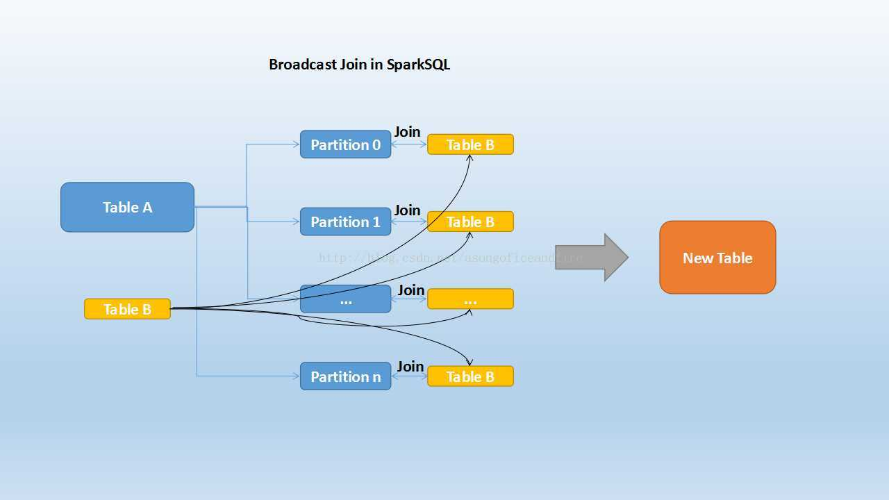
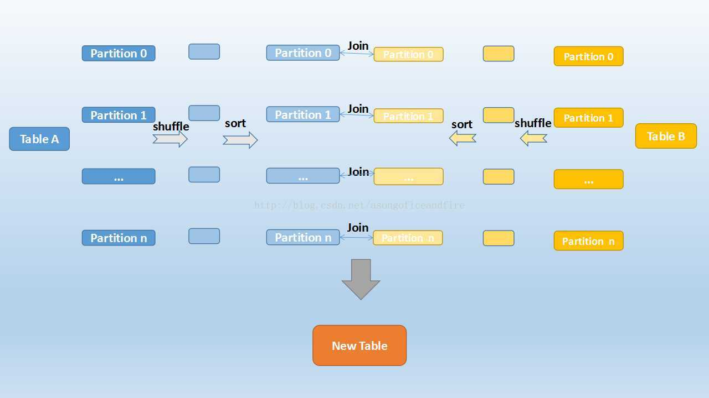
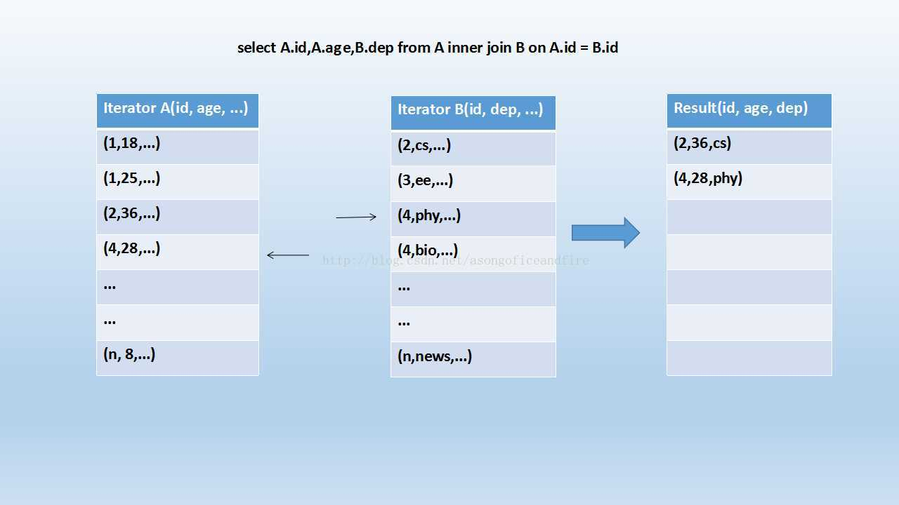

# Spark SQL

## Spark join的几种形式

### Broadcast Join

大家知道，在数据库的常见模型中（比如星型模型或者雪花模型），表一般分为两种：事实表和维度表。维度表一般指固定的、变动较少的表，例如联系人、物品种类等，一般数据有限。而事实表一般记录流水，比如销售清单等，通常随着时间的增长不断膨胀。

因为Join操作是对两个表中key值相同的记录进行连接，在SparkSQL中，对两个表做Join最直接的方式是先根据key分区，再在每个分区中把key值相同的记录拿出来做连接操作。但这样就不可避免地涉及到shuffle，而shuffle在Spark中是比较耗时的操作，我们应该尽可能的设计Spark应用使其避免大量的shuffle。

当维度表和事实表进行Join操作时，为了避免shuffle，我们可以将大小有限的维度表的全部数据分发到每个节点上，供事实表使用。executor存储维度表的全部数据，一定程度上牺牲了空间，换取shuffle操作大量的耗时，这在SparkSQL中称作Broadcast Join，如下图所示：

  
 

Table B是较小的表，黑色表示将其广播到每个executor节点上，Table A的每个partition会通过block manager取到Table A的数据。根据每条记录的Join Key取到Table B中相对应的记录，根据Join Type进行操作。这个过程比较简单，不做赘述。

Broadcast Join的条件有以下几个：

1. 被广播的表需要小于spark.sql.autoBroadcastJoinThreshold所配置的值，默认是10M （或者加了broadcast join的hint）
2. 基表不能被广播，比如left outer join时，只能广播右表

**缺点：**

1. 这个方案只能用于广播较小的表，否则数据的冗余传输就远大于shuffle的开销
2. 广播时需要将被广播的表先collect到driver端，当频繁有广播出现时，对driver的内存也是一个考验

### Shuffle Hash Join

当一侧的表比较小时，我们选择将其广播出去以避免shuffle，提高性能。但因为被广播的表首先被collect到driver段，然后被冗余分发到每个executor上，所以当表比较大时，采用broadcast join会对driver端和executor端造成较大的压力。

但由于Spark是一个分布式的计算引擎，可以通过分区的形式将大批量的数据划分成n份较小的数据集进行并行计算。这种思想应用到Join上便是Shuffle Hash Join了。利用key相同必然分区相同的这个原理，SparkSQL将较大表的join分而治之，先将表划分成n个分区，再对两个表中相对应分区的数据分别进行Hash Join，这样即在一定程度上减少了driver广播一侧表的压力，也减少了executor端取整张被广播表的内存消耗。其原理如下图：

  
 

Shuffle Hash Join分为两步：

1. 对两张表分别按照join keys进行重分区，即shuffle，目的是为了让有相同join keys值的记录分到对应的分区中
2. 对对应分区中的数据进行join，此处先将小表分区构造为一张hash表，然后根据大表分区中记录的join keys值拿出来进行匹配

Shuffle Hash Join的条件有以下几个：

1. 分区的平均大小不超过spark.sql.autoBroadcastJoinThreshold所配置的值，默认是10M 
2. 基表不能被广播，比如left outer join时，只能广播右表
3. 一侧的表要明显小于另外一侧，小的一侧将被广播（明显小于的定义为3倍小，此处为经验值）

我们可以看到，在一定大小的表中，SparkSQL从时空结合的角度来看，将两个表进行重新分区，并且对小表中的分区进行hash化，从而完成join。在保持一定复杂度的基础上，尽量减少driver和executor的内存压力，提升了计算时的稳定性。

### Sort Merge Join

上面介绍的两种实现对于一定大小的表比较适用，但当两个表都非常大时，显然无论适用哪种都会对计算内存造成很大压力。这是因为join时两者采取的都是hash join，是将一侧的数据完全加载到内存中，使用hash code取join keys值相等的记录进行连接。

当两个表都非常大时，SparkSQL采用了一种全新的方案来对表进行Join，即Sort Merge Join。这种实现方式不用将一侧数据全部加载后再进行hash join，但需要在join前将数据排序，如下图所示：

  
 

可以看到，首先将两张表按照join keys进行了重新shuffle，保证join keys值相同的记录会被分在相应的分区。分区后对每个分区内的数据进行排序，排序后再对相应的分区内的记录进行连接，如下图示：

  
 

看着很眼熟吧？也很简单，因为两个序列都是有序的，从头遍历，碰到key相同的就输出；如果不同，左边小就继续取左边，反之取右边。

可以看出，无论分区有多大，Sort Merge Join都不用把某一侧的数据全部加载到内存中，而是即用即取即丢，从而大大提升了大数据量下sql join的稳定性。

 

来自 <<https://blog.csdn.net/asongoficeandfire/article/details/53574034>>
