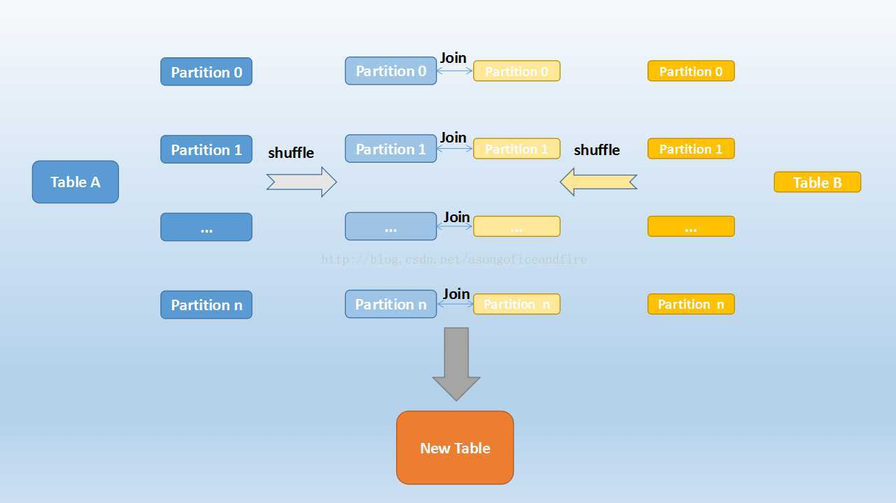
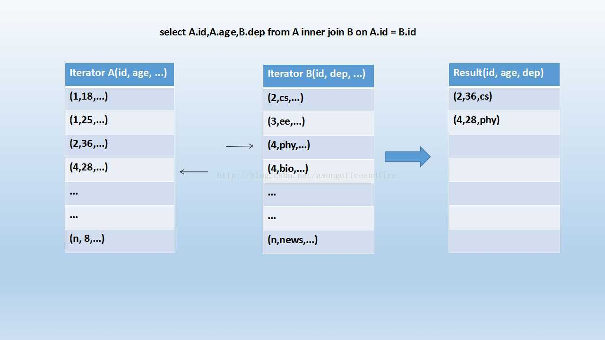

# Spark

## 基本工作流程

Spark应用程序运行在分布式集群上，通过集群管理器集群管理器（cluster manger）将驱动程序（driver program）节点跟工作节点（work node）相连，实现分布式并行工作。

<div align="center">  </div><br>

所有的Spark应用程序都离不开SparkContext和Executor两部分：

- Executor负责执行任务，运行Executor的机器称为Worker节点。

- SparkContext由用户程序启动，通过资源调度模块和Executor通信。

​    首先，创建SparkContext，SparkContext是程序的入口，允许Driver通过cluster manager访问集群，Driver将SparkContext中的配置信息发送给cluster manager，cluster manager收到配置信息后启动工作节点，在每个工作节点上创建Excutor，为每个Excutor分配内存空间和CPU等资源。SparkContext在初始化过程中会分别创建作业调度(DAGScheduler)和任务调度(TaskScheduler)两个调度模块。

​    程序执行时，根据RDD中的依赖关系构建有向无环图DAG。DAGScheduler将DAG根据依赖关系(宽依赖)划分为若干个Stage。每个Stage都是一组任务集TaskSet，提交给TaskScheduler。TaskScheduler负责任务的具体调度，根据RDD的分区个数将Stage划分为相同数目的task，分配到各个Excutor中执行。Excutor会为每一个任务创建一个TaskRunner，将任务放到任务列表，提交到线程池运行。 

## Spark的特点：

- 处理速度快：spark支持内存级计算功能，因此spark执行速度要远远高于hadoop
- 多语言、多API支持：park支持多语言。Spark允许Java、Scala、Python及R，这允许更多的开发者在自己熟悉的语言环境下进行工作，普及了Spark的应用范围。
- 多业务场景支持：提供了对etl、流处理、机器学习和图计算等几种主流数据处理场景的支持
- 开源生态环境支持

**Spark相对于Hadoop MapReduce的优势：**

1. RDD提供了丰富的操作算子，不再是只有map和reduce两个操作了，对于描述应用程序来说更加方便；

2. 通过RDDs之间的转换构建DAG，中间结果不用落地；

3. RDD支持缓存，可以在内存中快速完成计算。

## 运行模式

1. Local：本地模式，使用n个线程

2. Local Cluster:为分布式模式，开启多个虚拟节点

3. Standlone:分布式模式，使用Spark原生资源管理器

4. Mesos:使用Mesos作为资源管理器

5. Yarn:使用Yarn作为资源管理器


## RDD

RDD全称叫做弹性分布式数据集(Resilient Distributed Datasets)

- 它是一种分布式的内存抽象，表示一个**只读**的记录**分区**的集合
- 可以通过内部集合或者外部存储系统创建，或者由其他RDD转换而来。由于对RDD进行改动只能通过RDD的转换操作，新的RDD包含了从其他RDD衍生所必需的信息。
- RDDs之间存在依赖，RDD的执行是按照血缘关系延时计算的。
- RDD的计算都是以分区为单位的，每个分区计算操作都在一个单独的任务中被执行，RDD分区的多少涉及并行计算的粒度。

**内部数据结构：**

RDD主要由以下几个主要部分组成：（自己实现RDD）

- Partitions——分区集合
- Partitioner——分区函数 
- Dependencies——RDD依赖关系
- Compute(partition)——对于给定的数据集需要做哪些计算，针对每个分区的计算
- perferedLocations——数据位置偏好（以利用数据本地性）

**不足：**

1.不支持细粒度的写操作

2.不支持增量迭代计算（计算的时候只计算一部分数据）

**依赖关系：**

RDD中存在两种依赖关系：

- 窄依赖：每个父RDD的分区只能被一个子RDD分区使用
- 宽依赖：每个父RDD的分区可以被子RDD的多个分区使用，会产生shuffle

<div align="center">  </div><br>

窄依赖可以使作业以流水线的方式运行，而宽依赖需要获取父RDD的所有分区，需要类似于Hadoop中的shuffle操作。对于窄依赖，计算节点失效后只需重新计算父RDD的一个分区即可，而宽依赖需要重新计算父RDD的多个分区，代价较大。DAGScheduler划分Stage时根据宽依赖划分。

**容错：**

利用RDD的血统关系和RDD缓存以及检查点。

 

## 任务调度模块

​    DAGScheduler负责逻辑调度，TaskScheduler负责物理调度。二者在SparkContext初始化时创建，action算子通过间接调用submitJob()或者runJob()提交任务到DAGScheduler。整个调度模块可以分为五个部分：

- 调度阶段的拆分：首先针对一段应用代码，driver会以action算子为边界生成响应的DAG图。DAGScheduler就是根据DAG图，从图的末端逆向遍历整个依赖链，一般是以一次shuffle为边界来划分的。一般划分stage是从程序执行流程的最后往前划分，遇到宽依赖就断开，遇到窄依赖就将将其加入当前stage中。
- 调度阶段的提交：在划分阶段可以得到多个Stage，其中直接触发作业的Stage称为finalStage。首先判断该Stage所依赖的父Stage是否可用，若可用则提交该Stage，反之，则尝试迭代提交当前不可用的父Stage。在迭代过程中，所有由于依赖的Stage不可用的Stage放入等待队列，当某个Stage完成之后，DAGScheduler会重新扫描等待队列中的Stage,检查是否还有依赖的Stage没有完成。如果没有，则尝试提交Stage。
- 任务集的提交：Stage的提交最终会转换为一个TaskSet的提交，DAGScheduler通过taskScheduler提交任务集。Task Scheduler根据一定的调度算法，将接收到的task池中的task分给work node节点中的executor执行。TaskScheduler会为每个TaskSet创建一个TaskSetManager用于管理TaskSet的调度和生命周期。TaskSetManager会根据动态本地性调整策略分配任务：如果上一次成功提交任务的时间长，则会降低本地性要求，否则提高本地性要求。
- 状态的监控：taskScheduler通过一些回调函数同时DAGScheduler具体的Excutor的生命状态，在DAGScheduler中是通过receive偏函数进行处理。
- 任务结果的获取：一个具体任务在Excutor中执行完毕后需要将结果返回给DAGScheduler。对于FinalStage对应的ResultTask返回的是运算结果本身，而对于ShuffleMapTask则返回的是MapStatus。MapStatus维护着对应的ShuffleMapTask结果的元数据信息，比如存储结果的blockid。下一个Stage可以根据MapStatus获取对应的计算结果。

## Spark存储模块

Spark存储模块主要有两个部分：通信层架构和存储层架构。

### 通信层架构

在Spark集群中，当提交一个Application执行时，该Application对应的Driver以及所有的Executor上，都存在一个BlockManager、BlockManagerMaster，而BlockManagerMaster是负责管理各个BlockManager之间通信。每个Executor的BlockManager都只负责自身数据的元信息，而Driver端的BlockManagerMaster维护所有的已注册的BlockManager信息和所有的元数据信息，是通过三个HashMap实现的。当Excutor需要获取非本地数据时，需要向Driver查询，消息通信是通过netty实现的，主从节点之间包含彼此的终端点引用，可以相互通信。而slave之间也通过消息通信交换RDD控制信息。

### 存储层架构

分为RDD缓存和shuffle缓存。RDD由不同的分区组成，所有计算操作都是以**分区**为单位。存储时RDD又是由不同的数据块组成，本质上分区和数据块是等价的。Spark中存储的最小管理单元是数据块，对Block的查询、存储管理，是通过唯一的Block ID来进行区分的。Spark可以在内存和磁盘中对RDD进行持久化，分别对应了内存和磁盘的存储管理。

**内存管理：**

作为一个 JVM 进程，Executor 的内存管理建立在 JVM 的内存管理之上，Spark 对 JVM 的堆内（On-heap）空间进行了更为详细的分配，以充分利用内存。同时，Spark 引入了堆外（Off-heap）内存，使之可以直接在工作节点的系统内存中开辟空间，进一步优化了内存的使用。

**一、堆内内存**

堆内内存的大小，由 Spark 应用程序启动时的 –executor-memory 或 spark.executor.memory 参数配置。Executor 内运行的并发任务共享 JVM 堆内内存。

- 存储（Storage）内存：任务在缓存 RDD 数据和广播（Broadcast）数据时占用的内存

- 执行（Execution）内存：任务在执行 Shuffle 时占用的内存

- 其他：剩余的部分不做特殊规划，那些 Spark 内部的对象实例，或者用户定义的 Spark 应用程序中的对象实例，均占用剩余的空间。

不同的管理模式下，这三部分占用的空间大小各不相同。

Spark 对堆内内存的管理是一种逻辑上的"规划式"的管理，因为对象实例占用内存的申请和释放都由 JVM 完成，Spark 只能在申请后和释放前**记录**这些内存，我们来看其具体流程：

**申请内存**：

1. Spark 在代码中 new 一个对象实例
2. JVM 从堆内内存分配空间，创建对象并返回对象引用
3. Spark 保存该对象的引用，记录该对象占用的内存

**释放内存**：

1. Spark 记录该对象释放的内存，删除该对象的引用
2. 等待 JVM 的垃圾回收机制释放该对象占用的堆内内存

**对象存储：**

JVM 的对象可以以序列化的方式存储，序列化的过程是将对象转换为二进制字节流，本质上可以理解为将非连续空间的链式存储转化为连续空间或块存储，在访问时则需要进行序列化的逆过程——反序列化，将字节流转化为对象，序列化的方式可以节省存储空间，但增加了存储和读取时候的计算开销。

**OOM异常：**

对于 Spark 中序列化的对象，由于是字节流的形式，其占用的内存大小可直接计算，而对于非序列化的对象，其占用的内存是通过周期性地采样近似估算而得，即并不是每次新增的数据项都会计算一次占用的内存大小，这种方法降低了时间开销但是有可能误差较大，导致某一时刻的实际内存有可能远远超出预期。此外，在被 Spark 标记为释放的对象实例，很有可能在实际上并没有被 JVM 回收，导致实际可用的内存小于 Spark 记录的可用内存。所以 Spark 并不能准确记录实际可用的堆内内存，从而也就无法完全避免内存溢出（OOM, Out of Memory）的异常。

虽然不能精准控制堆内内存的申请和释放，但 Spark 通过对存储内存和执行内存各自独立的规划管理，可以决定是否要在存储内存里缓存新的 RDD，以及是否为新的任务分配执行内存，在一定程度上可以提升内存的利用率，减少异常的出现。

**二、堆外内存**

为了进一步优化内存的使用以及提高 Shuffle 时排序的效率，Spark 引入了堆外（Off-heap）内存，使之可以直接在工作节点的系统内存中开辟空间，存储经过序列化的二进制数据。利用 JDK Unsafe API（从 Spark 2.0 开始，在管理堆外的存储内存时不再基于 Tachyon，而是与堆外的执行内存一样，基于 JDK Unsafe API 实现）。除了没有 other 空间，堆外内存与堆内内存的划分方式相同，所有运行中的并发任务共享存储内存和执行内存。

**优点：**

- 可以被精确地申请和释放，序列化的数据占用的空间可以被精确计算，所以相比堆内内存来说降低了管理的难度，也降低了误差。
- 可以直接操作系统堆外内存，减少了不必要的内存开销，以及频繁的 GC 扫描和回收，提升了处理性能。

**配置：**

在默认情况下堆外内存并不启用

- spark.memory.offHeap.enabled 参数启用
- spark.memory.offHeap.size 参数设定堆外空间的大小

**三、 内存空间分配**

Spark 为存储内存和执行内存的管理提供了统一的接口——MemoryManager，同一个 Executor 内的任务都调用这个接口的方法来申请或释放内存:

MemoryManager 的具体实现上，Spark 1.6 之后默认为统一管理（[Unified Memory Manager](https://github.com/apache/spark/blob/v2.1.0/core/src/main/scala/org/apache/spark/memory/UnifiedMemoryManager.scala)）方式，1.6 之前采用的静态管理（[Static Memory Manager](https://github.com/apache/spark/blob/v2.1.0/core/src/main/scala/org/apache/spark/memory/StaticMemoryManager.scala)）方式仍被保留，可通过配置 spark.memory.useLegacyMode 参数启用。两种方式的区别在于对空间分配的方式。

1. **静态内存管理**

在 Spark 最初采用的静态内存管理机制下，存储内存、执行内存和其他内存的大小在 Spark 应用程序运行期间均为固定的，但用户可以应用程序启动前进行配置，堆内内存的分配如图所示：

<div align="center">  </div><br>

其中 systemMaxMemory 取决于当前 JVM 堆内内存的大小，最后可用的执行内存或者存储内存要在此基础上与各自的 memoryFraction 参数和 safetyFraction 参数相乘得出。上述计算公式中的两个 safetyFraction 参数，其意义在于在逻辑上预留出 1-safetyFraction 这么一块保险区域，降低因实际内存超出当前预设范围而导致 OOM 的风险（上文提到，对于非序列化对象的内存采样估算会产生误差）。值得注意的是，这个预留的保险区域仅仅是一种逻辑上的规划，在具体使用时 Spark 并没有区别对待，和"其它内存"一样交给了 JVM 去管理。

<div align="center">  </div><br>堆外的空间分配较为简单，只有存储内存和执行内存，如图所示。可用的执行内存和存储内存占用的空间大小直接由参数 spark.memory.storageFraction 决定，由于堆外内存占用的空间可以被精确计算，所以无需再设定保险区域。

堆外的空间分配较为简单，只有存储内存和执行内存。可用的执行内存和存储内存占用的空间大小直接由参数 spark.memory.storageFraction 决定，由于堆外内存占用的空间可以被精确计算，所以无需再设定保险区域。

2. **统一内存管理**

Spark 1.6 之后引入的统一内存管理机制，与静态内存管理的区别在于存储内存和执行内存共享同一块空间，可以动态占用对方的空闲区域。

 <div align="center">  </div><br>
 <div align="center">  </div><br>

其中最重要的优化在于动态占用机制，其规则如下：

- 设定基本的存储内存和执行内存区域（spark.storage.storageFraction 参数），该设定确定了双方各自拥有的空间的范围
- 双方的空间都不足时，则存储到硬盘；若己方空间不足而对方空余时，可借用对方的空间;（存储空间不足是指不足以放下一个完整的 Block）
- 执行内存的空间被对方占用后，可让对方将占用的部分转存到硬盘，然后"归还"借用的空间
- 存储内存的空间被对方占用后，无法让对方"归还"，因为需要考虑 Shuffle 过程中的很多因素，实现起来较为复杂

<div align="center">  </div><br>

凭借统一内存管理机制，Spark 在一定程度上提高了堆内和堆外内存资源的利用率，降低了开发者维护 Spark 内存的难度，但并不意味着开发者可以高枕无忧。譬如，所以如果存储内存的空间太大或者说缓存的数据过多，反而会导致频繁的全量垃圾回收，降低任务执行时的性能，因为缓存的 RDD 数据通常都是长期驻留内存的。所以要想充分发挥 Spark 的性能，需要开发者进一步了解存储内存和执行内存各自的管理方式和实现原理。

**四、存储内存管理**

**1. Spark RDD持久化**

RDD 的持久化由 Spark 的 Storage 模块负责，实现了 RDD 与物理存储的解耦合。Storage 模块负责管理 Spark 在计算过程中产生的数据，将那些在内存或磁盘、在本地或远程存取数据的功能封装了起来。

- 在具体实现时， Driver 端和 Executor 端的 Storage 模块构成了主从式的架构，即 Driver 端的 BlockManager 为 Master，Executor 端的 BlockManager 为 Slave。Master 负责整个 Spark 应用程序的 Block 的元数据信息的管理和维护，而 Slave 需要将 Block 的更新等状态上报到 Master，同时接收 Master 的命令，例如新增或删除一个 RDD。

- Storage 模块在逻辑上以 Block 为基本存储单位，RDD 的每个 Partition 经过处理后唯一对应一个 Block（BlockId 的格式为 rdd_RDD-ID_PARTITION-ID ）。

  <div align="center">  </div><br>

- Spark 规定了 MEMORY_ONLY、MEMORY_AND_DISK 等 7 种不同的 [存储级别 ](http://spark.apache.org/docs/latest/programming-guide.html#rdd-persistence)，而存储级别是以下 5 个变量的组合：

``` scala
class StorageLevel private(
private var _useDisk: Boolean, //磁盘
private var _useMemory: Boolean, //这里其实是指堆内内存
private var _useOffHeap: Boolean, //堆外内存
private var _deserialized: Boolean, //是否为非序列化
private var _replication: Int = 1 //副本个数
)
```

​	通过对数据结构的分析，可以看出存储级别从三个维度定义了 RDD 的 Partition（同时也就是 Block）的存储方式：

1. 存储位置：磁盘／堆内内存／堆外内存。如 MEMORY_AND_DISK 是同时在磁盘和堆内内存上存储，实现了冗余备份。OFF_HEAP 则是只在堆外内存存储，目前选择堆外内存时不能同时存储到其他位置。

2. 存储形式：Block 缓存到存储内存后，是否为非序列化的形式。如 MEMORY_ONLY 是非序列化方式存储，OFF_HEAP 是序列化方式存储。
3. 副本数量：大于 1 时需要远程冗余备份到其他节点。如 DISK_ONLY_2 需要远程备份 1 个副本。

**2 . RDD 缓存的过程**

RDD 在缓存到存储内存之前，Partition 中的数据一般以迭代器（[Iterator](http://www.scala-lang.org/docu/files/collections-api/collections_43.html)）的数据结构来访问，这是 Scala 语言中一种遍历数据集合的方法。通过 Iterator 可以获取分区中每一条序列化或者非序列化的数据项(Record)，这些 Record 的对象实例在逻辑上占用了 JVM 堆内内存的 other 部分的空间，同一 Partition 的不同 Record 的空间并不连续。

RDD 在缓存到存储内存之后，Partition 被转换成 Block，Record 在堆内或堆外存储内存中占用一块连续的空间。将Partition由不连续的存储空间转换为连续存储空间的过程，Spark称之为"展开"（Unroll）。Block 有序列化和非序列化两种存储格式，具体以哪种方式取决于该 RDD 的存储级别。每个 Executor 的 Storage 模块用一个链式 Map 结构（LinkedHashMap）来管理堆内和堆外存储内存中所有的 Block 对象的实例。因为不能保证存储空间可以一次容纳 Iterator 中的所有数据，当前的计算任务在 Unroll 时要向 MemoryManager 申请足够的 Unroll 空间来临时占位，空间不足则 Unroll 失败，空间足够时可以继续进行。

- 对于序列化的 Partition，其所需的 Unroll 空间可以直接累加计算，一次申请。

- 非序列化的 Partition 则要在遍历 Record 的过程中依次申请，即每读取一条 Record，采样估算其所需的 Unroll 空间并进行申请，空间不足时可以中断，释放已占用的 Unroll 空间。如果最终 Unroll 成功，当前 Partition 所占用的 Unroll 空间被转换为正常的缓存 RDD 的存储空间。

  <div align="center">  </div><br>

​    在静态内存管理时，Spark 在存储内存中专门划分了一块 Unroll 空间，其大小是固定的，统一内存管理时则没有对 Unroll 空间进行特别区分，当存储空间不足时会根据动态占用机制进行处理。

**3.  淘汰和落盘**

由于同一个 Executor 的所有的计算任务共享有限的存储内存空间，当有新的 Block 需要缓存但是剩余空间不足且无法动态占用时，就要对 LinkedHashMap 中的旧 Block 进行淘汰（Eviction），而被淘汰的 Block 如果其存储级别中同时包含存储到磁盘的要求，则要对其进行落盘（Drop），否则直接删除该 Block。

存储内存的淘汰规则为：

- 被淘汰的旧 Block 要与新 Block 的 MemoryMode 相同，即同属于堆外或堆内内存
- 新旧 Block 不能属于同一个 RDD，避免循环淘汰
- 旧 Block 所属 RDD 不能处于被读状态，避免引发一致性问题
- 遍历 LinkedHashMap 中 Block，按照最近最少使用（LRU）的顺序淘汰，直到满足新 Block 所需的空间。其中 LRU 是 LinkedHashMap 的特性。

落盘的流程则比较简单，如果其存储级别符合useDisk 为 true 的条件，再根据其deserialized 判断是否是非序列化的形式，若是则对其进行序列化，最后将数据存储到磁盘，在 Storage 模块中更新其信息。

**五、 执行内存管理**

1. **多任务间内存分配**

Executor 内运行的任务同样共享执行内存，Spark 用一个 HashMap 结构保存了任务到内存耗费的映射。每个任务可占用的执行内存大小的范围为 1/2N ~ 1/N，其中 N 为当前 Executor 内正在运行的任务的个数。每个任务在启动之时，要向 MemoryManager 请求申请最少为 1/2N 的执行内存，如果不能被满足要求则该任务被阻塞，直到有其他任务释放了足够的执行内存，该任务才可以被唤醒。

2. **Shuffle 的内存占用**

执行内存主要用来存储任务在执行 Shuffle 时占用的内存，Shuffle 是按照一定规则对 RDD 数据重新分区的过程，我们来看 Shuffle 的 Write 和 Read 两阶段对执行内存的使用：

- Shuffle Write

1. 若在 map 端选择普通的排序方式，会采用 ExternalSorter 进行外排，在内存中存储数据时主要占用**堆内**执行空间。
2. 若在 map 端选择 Tungsten 的排序方式，则采用 ShuffleExternalSorter 直接对以**序列化**形式存储的数据排序，在内存中存储数据时可以占用**堆外或堆内**执行空间，取决于用户是否开启了堆外内存以及堆外执行内存是否足够。

- Shuffle Read

1. 在对 reduce 端的数据进行聚合时，要将数据交给 Aggregator 处理，在内存中存储数据时占用堆内执行空间。
2. 如果需要进行最终结果排序，则要将再次将数据交给 ExternalSorter 处理，占用堆内执行空间。

在 ExternalSorter 和 Aggregator 中，Spark 会使用一种叫 **AppendOnlyMap** 的哈希表在堆内执行内存中存储数据，但在 Shuffle 过程中所有数据并不能都保存到该哈希表中，对这个哈希表占用的内存会进行周期性地采样估算，当其大到一定程度，无法再从 MemoryManager 申请到新的执行内存时，Spark 就会将其全部内容存储到磁盘文件中，这个过程被称为溢存(Spill)，溢存到磁盘的文件最后会被归并(Merge)。

Shuffle Write 阶段中用到的 Tungsten 是 Databricks 公司提出的对 Spark 优化内存和 CPU 使用的计划，解决了一些 JVM 在性能上的限制和弊端。Spark 会根据 Shuffle 的情况来自动选择是否采用 Tungsten 排序。Tungsten 采用的页式内存管理机制建立在 MemoryManager 之上，即 Tungsten 对执行内存的使用进行了一步的抽象，这样在 Shuffle 过程中无需关心数据具体存储在堆内还是堆外。每个内存页用一个 MemoryBlock 来定义，并用 Object obj 和 long offset 这两个变量统一标识一个内存页在系统内存中的地址。堆内的 MemoryBlock 是以 long 型数组的形式分配的内存，其 obj 的值为是这个数组的对象引用，offset 是 long 型数组的在 JVM 中的初始偏移地址，两者配合使用可以定位这个数组在堆内的绝对地址；堆外的 MemoryBlock 是直接申请到的内存块，其 obj 为 null，offset 是这个内存块在系统内存中的 64 位绝对地址。Spark 用 MemoryBlock 巧妙地将堆内和堆外内存页统一抽象封装，并用页表(pageTable)管理每个 Task 申请到的内存页。

Tungsten 页式管理下的所有内存用 64 位的逻辑地址表示，由页号和页内偏移量组成：

- 页号：占 13 位，唯一标识一个内存页，Spark 在申请内存页之前要先申请空闲页号。
- 页内偏移量：占 51 位，是在使用内存页存储数据时，数据在页内的偏移地址。

有了统一的寻址方式，Spark 可以用 64 位逻辑地址的指针定位到堆内或堆外的内存，整个 Shuffle Write 排序的过程只需要对指针进行排序，并且无需反序列化，整个过程非常高效，对于内存访问效率和 CPU 使用效率带来了明显的提升。

**Spark Shuffle持久化**

与RDD持久化不同，shuffle持久化必须在磁盘。shuffle持久化有两种方式：一种是将shuffle数据块映射成文件，另一种是将数据块映射为文件的一段，将分时运行的map任务产生的shuffle数据块合并到一个文件中。这与shuffle的方式有关。

Spark 的存储内存和执行内存有着截然不同的管理方式：对于存储内存来说，Spark 用一个 LinkedHashMap 来集中管理所有的 Block，Block 由需要缓存的 RDD 的 Partition 转化而成；而对于执行内存，Spark 用 AppendOnlyMap 来存储 Shuffle 过程中的数据，在 Tungsten 排序中甚至抽象成为页式内存管理，开辟了全新的 JVM 内存管理机制。

**参考链接：**

- [Apache Spark 内存管理详解](https://www.ibm.com/developerworks/cn/analytics/library/ba-cn-apache-spark-memory-management/index.html) 

## Spark Shuffle过程

Shuffle的中文解释为“洗牌操作”，可以理解成将集群中所有节点上的数据进行重新整合分类的过程。Spark shuffle有三种方式：hashShuffle（后期优化有consolidate shuffle）、sort shuffle和tungsten-sort shuffle。Spark1.1之前是HashShuffle默认的分区器是HashPartitioner，Spark1.1引入SortShuffle，默认的分区器是RangePartitioner。

https://imcoder.site/article.do?method=detail&aid=168
### Shuffle 分类
#### Hash Shuffle

**使用场景：**适合小数据量

**过程：**每一个map task将不同结果写到不同的buffer中，每个buffer的大小为32K。buffer起到数据缓存的作用。 Map task会根据分区器(默认是hashPartitioner)算出当前key需写入的 partition，然后经过对应的缓存写入单独的文件，所以 buffer缓存的个数即小文件的个数，由下一个Stage的并行度(ReduceTask个数)决定，使得每一个task 产生R个文件(ReduceTask个数)。如果有m个map task，则有M*R个小文件。然后reduce task来拉取对应的磁盘小文件。

<div align="center">  </div><br>

 

**开启：**spark.shuffle.manager=hash 

**缺点：**产生的磁盘小文件过多，会导致以下问题：

- 在Shuffle Write过程中会产生很多写磁盘小文件的对象 
-  在Shuffle Read过程中会产生很多读取磁盘小文件的对象
- 在JVM堆内存中对象过多会造成频繁的GC，GC还无法解决运行所需要的内存的话，就会OOM
- 在数据传输过程中会有频繁的网络通信，频繁的网络通信出现通信故障的可能性大大增加，一旦网络通信出现了故障会导致shuffle file cannot find。由于这个错误导致的task失败，TaskScheduler不负责重试，由DAGScheduler负责重试Stage。

#### Hash Shuffle Consolidate：

**使用场景：**Spark在引入Sort-Based Shuffle之前，适合中小型数据规模的大数据处理！ 

**过程：**每个 Executor 里的map task 共用 一个buffer写缓存。也就是一个Excutor才有 R个小文件。所有小文件数量会减少到C*R个(C指在Mapper端能够使用的Core数，有多少个Core就可以设置多少个Executor)

<div align="center">  </div><br>

**开启方法：** spark.shuffle.consolidateFiles=true

**优点：**Consolidate并没有降低并行度，只是降低了临时文件的数量，此时Mapper端的内存消耗就会变少，所以OOM也就会降低，另外一方面磁盘的性能也会变得更好

**缺点：**如果Reducer端的并行数据分片过多的话则C*R可能已经过大，此时依旧没有逃脱文件打开过多的厄运

#### Sort-based Shuffle

**使用场景：**适合大数据量

来自 <<https://blog.csdn.net/snail_gesture/article/details/50807129>>

**过程：**

1. MapTask处理 Partition 里的数据时，会向一个大小为5M的内存数据结构里写数据。

2. 每插入32次数据，就会检查一次内存大小，如果内存大小 size超过5M就会申请（size\*2 - 5）M 的空间，如果申请成功不会进行溢写，如果申请不成功，这时候会发生溢写磁盘。

3. 溢写会先排序与分区，再以每个batch为1万条数据溢写到32k的内存缓存区，然后再溢写到磁盘（产生大量磁盘小文件）。

4. MapTask结束后，会将将这些小文件合并成一个大文件和一个索引文件 。

5. ReduceTask 从MapTask拉取数据时（最大可以拉取48M），首先解析索引文件，根据索引文件再去拉取对应的数据。

6. 后会将这些文件放到 Executor 的shuffle聚合内存(为Executor内存的20%)聚合。

7. 所以SortShuffler会产生2\*M个文件（2为一个大文件一个索引文件，M为MapTask个数）

   <div align="center">  </div><br> 

每个ShuffleMapTask不会为每个Reducer单独生成一个文件，相反，Sort-based Shuffle会把Mapper中每个ShuffleMapTask所有的输出数据Data只写到一个文件中。基于Sort-base的Shuffle会在Mapper中的每一个ShuffleMapTask中产生两个文件：Data文件和Index文件，其中Data文件是存储当前Task的Shuffle输出的。而index文件中则存储了Data文件中的数据通过Partitioner的分类信息，此时下一个阶段的Stage中的Task就是根据这个Index文件获取自己所要抓取的上一个Stage中的ShuffleMapTask产生的数据的，Reducer就是根据index文件来获取属于自己的数据。 

**开启:** spark.shuffle.manager=sort    sort为1.6默认

**缺点：** 

- 如果Mapper中Task的数量过大，依旧会产生很多小文件，此时在Shuffle传递数据的过程中到Reducer端，reduce会需要同时打开大量的记录来进行反序列化，导致大量的内存消耗和GC的巨大负担，造成系统缓慢甚至崩溃
- 如果需要在分片内也进行排序的话，此时需要进行Mapper端和Reducer端的两次排序

**优化：** 可以改造Mapper和Reducer端，改框架来实现一次排序。 频繁GC的解决办法是：钨丝计划！！ 

**bypass运行机制**：当数据量比较小，或者不需要要对数据进行排序，这时SortShuffler中的排序就没用了。

<div align="center">  </div><br>

触发不进行排序的条件：

- 当 shuffle ReduceTask 的个数小于参数值时，spark.shuffle.sort.bypassMergeThreshold 默认值 200。

- 不是聚合类shuffle算子时

#### Tungsten-sort shuffle

<https://www.jianshu.com/p/d328c96aebfd>

**使用条件：**当且仅当下面条件都满足时，才会使用新的Shuffle方式：

- Shuffle dependency 不能带有aggregation 或者输出需要排序
- Shuffle 的序列化器需要是KryoSerializer或者Spark SQL自定义的一些序列化方式.
- Shuffle 文件的数量不能大于 16777216
- 序列化时，单条记录不能大于 128 MB

**开启：**Spark 默认开启的是Sort Based Shuffle，想要打开Tungsten-sort，请设置spark.shuffle.manager=tungsten-sort

**优点：**主要在三个方面:

- 直接在serialized binary data上sort而不是java objects，减少了memory的开销和GC的overhead。
- 提供cache-efficient sorter，使用一个8 bytes的指针，把排序转化成了一个指针数组的排序。
- spill的merge过程也无需反序列化即可完成

**实现：**引入了一个新的内存管理模型，类似OS的Page，对应的实际数据结构为MemoryBlock，支持off-heap 以及 in-heap 两种模式。为了能够对Record 在这些MemoryBlock进行定位，引入了Pointer(指针)的概念。

Sort Based Shuffle里存储数据的对象PartitionedAppendOnlyMap是一个放在JVM heap里普通对象，在Tungsten-sort中，被替换成了类似操作系统内存页的对象。如果你无法申请到新的Page，这个时候就要执行spill操作，也就是写入到磁盘的操作。

<div align="center">  </div><br> 

这张图其实画的是 on-heap 的内存逻辑图，其中 #Page 部分为13bit, Offset 为51bit,你会发现 2^51 >>128M的。但是在Shuffle的过程中，对51bit 做了压缩，使用了27bit,具体如下：

 \[24 bit partition number\]\[13 bit memory page number\]\[27 bit offset in page\]

这里预留出的24bit给了partition number,为了后面的排序用。上面的好几个限制其实都是因为这个指针引起的：

- 一个是partition 的限制，前面的数字 16777216 就是来源于partition number 使用24bit 表示的。
- 第二个是page number
- 第三个是偏移量，最大能表示到2^27=128M。那一个task 能管理到的内存是受限于这个指针的，最多是 2^13 * 128M 也就是1TB左右。

有了这个指针，我们就可以定位和管理到off-heap 或者 on-heap里的内存了。这个模型还是很漂亮的，内存管理也非常高效，记得之前的预估PartitionedAppendOnlyMap的内存是非常困难的，但是通过现在的内存管理机制，是非常快速并且精确的。

对于第一个限制，那是因为后续Shuffle Write的sort 部分，只对前面24bit的partiton number 进行排序，key的值没有被编码到这个指针，所以没办法进行ordering

同时，因为整个过程是追求不反序列化的，所以不能做aggregation。


### Spark hashPartitioner和rangePartitioner的实现

- hashPartitioner分区：对于给定的key计算其hashCode，对分区数除余，得到key所属分区的id。可能导致分区中的数据量不均匀。

- RangePartitioner分区：尽量保证每个分区中的数据量均匀，而且分区和分区之间是有序的，但是分区内部元素不一定有序。总的来说RangePartitioner就是将一定范围内的数据映射到某个分区中。使用蓄水池抽样算法从RDD中抽取样本，对样本排序，计算出每个分区的最大key值，形成一个范围区间，判断key在区间内所处的范围，给出对应的分区id。该分区器要求key类型必须是可以排序的。

### map端计算结果缓存处理并简述appendOnlyMap和 ExternalAppendOnlyMap

HashMap 是 Spark shuffle read 过程中频繁使用的、用于 aggregate 的数据结构。Spark 设计了两种：一种是全内存的 AppendOnlyMap，另一种是内存＋磁盘的 ExternalAppendOnlyMap。下面我们来分析一下两者特性及内存使用情况。

#### AppendOnlyMap

AppendOnlyMap 的官方介绍是 A simple open hash table optimized for the append-only use case, where keys are never removed, but the value for each key may be changed。意思是类似 HashMap，但没有remove(key)方法。其实现原理很简单，开一个大 Object 数组，蓝色部分存储 Key，白色部分存储 Value。如下图：

<div align="center">  </div><br>

当要 put(K, V) 时，先 hash(K) 找存放位置，如果存放位置已经被占用，就使用 Quadratic probing 探测方法来找下一个空闲位置。对于图中的 K6 来说，第三次查找找到 K4 后面的空闲位置，放进去即可。get(K6) 的时候类似，找三次找到 K6，取出紧挨着的 V6，与先来的 value 做 func，结果重新放到 V6 的位置。

迭代 AppendOnlyMap 中的元素的时候，从前到后扫描输出。

如果 Array 的利用率达到 70%，那么就扩张一倍，并对所有 key 进行 rehash 后，重新排列每个 key 的位置。

AppendOnlyMap 还有一个 destructiveSortedIterator(): Iterator[(K, V)] 方法，可以返回 Array 中排序后的 (K, V) pairs。实现方法很简单：先将所有 (K, V) pairs compact 到 Array 的前端，并使得每个 (K, V) 占一个位置（原来占两个），之后直接调用 Array.sort() 排序，不过这样做会破坏数组（key 的位置变化了）。

#### ExternalAppendOnlyMap

<div align="center">  </div><br>

相比 AppendOnlyMap，ExternalAppendOnlyMap 的实现略复杂，但逻辑其实很简单，类似 Hadoop MapReduce 中的 shuffle-merge-combine-sort 过程：

ExternalAppendOnlyMap 持有一个 AppendOnlyMap，shuffle 来的一个个 (K, V) record 先 insert 到 AppendOnlyMap 中，insert 过程与原始的 AppendOnlyMap 一模一样。如果 AppendOnlyMap 快被装满时检查一下内存剩余空间是否可以够扩展，够就直接在内存中扩展，不够就 sort 一下 AppendOnlyMap，将其内部所有 records 都 spill 到磁盘上。图中 spill 了 4 次，每次 spill 完在磁盘上生成一个 spilledMap 文件，然后重新 new 出来一个 AppendOnlyMap。最后一个 (K, V) record insert 到 AppendOnlyMap 后，表示所有 shuffle 来的 records 都被放到了 ExternalAppendOnlyMap 中，但不表示 records 已经被处理完，因为每次 insert 的时候，新来的 record 只与 AppendOnlyMap 中的 records 进行 aggregate，并不是与所有的 records 进行 aggregate（一些 records 已经被 spill 到磁盘上了）。因此当需要 aggregate 的最终结果时，需要对 AppendOnlyMap 和所有的 spilledMaps 进行全局 merge-aggregate。

全局 merge-aggregate 的流程也很简单：先将 AppendOnlyMap 中的 records 进行 sort，形成 sortedMap。然后利用 DestructiveSortedIterator 和 DiskMapIterator 分别从 sortedMap 和各个 spilledMap 读出一部分数据（StreamBuffer）放到 mergeHeap 里面。StreamBuffer 里面包含的 records 需要具有相同的 hash(key)，所以图中第一个 spilledMap 只读出前三个 records 进入 StreamBuffer。mergeHeap 顾名思义就是使用堆排序不断提取出 hash(firstRecord.Key) 相同的 StreamBuffer，并将其一个个放入 mergeBuffers 中，放入的时候与已经存在于 mergeBuffers 中的 StreamBuffer 进行 merge-combine，第一个被放入 mergeBuffers 的 StreamBuffer 被称为 minBuffer，那么 minKey 就是 minBuffer 中第一个 record 的 key。当 merge-combine 的时候，与 minKey 相同的 records 被 aggregate 一起，然后输出。整个 merge-combine 在 mergeBuffers 中结束后，StreamBuffer 剩余的 records 随着 StreamBuffer 重新进入 mergeHeap。一旦某个 StreamBuffer 在 merge-combine 后变为空（里面的 records 都被输出了），那么会使用 DestructiveSortedIterator 或 DiskMapIterator 重新装填 hash(key) 相同的 records，然后再重新进入 mergeHeap。

整个 insert-merge-aggregate 的过程有三点需要进一步探讨一下：

- 内存剩余空间检测

与 Hadoop MapReduce 规定 reducer 中 70% 的空间可用于 shuffle-sort 类似，Spark 也规定 executor 中 spark.shuffle.memoryFraction * spark.shuffle.safetyFraction 的空间（默认是0.3 * 0.8）可用于 ExternalOnlyAppendMap。Spark 略保守是不是？更保守的是这 24％ 的空间不是完全用于一个 ExternalOnlyAppendMap 的，而是由在 executor 上同时运行的所有 reducer 共享的。为此，exectuor 专门持有一个 ShuffleMemroyMap: HashMap[threadId, occupiedMemory] 来监控每个 reducer 中 ExternalOnlyAppendMap 占用的内存量。每当 AppendOnlyMap 要扩展时，都会计算 ShuffleMemroyMap 持有的所有 reducer 中的 AppendOnlyMap 已占用的内存 ＋ 扩展后的内存 是会否会大于内存限制，大于就会将 AppendOnlyMap spill 到磁盘。有一点需要注意的是前 1000 个 records 进入 AppendOnlyMap 的时候不会启动是否要 spill 的检查，需要扩展时就直接在内存中扩展。

- AppendOnlyMap 大小估计

为了获知 AppendOnlyMap 占用的内存空间，可以在每次扩展时都将 AppendOnlyMap reference 的所有 objects 大小都算一遍，然后加和，但这样做非常耗时。所以 Spark 设计了粗略的估算算法，算法时间复杂度是 O(1)，核心思想是利用 AppendOnlyMap 中每次 insert-aggregate record 后 result 的大小变化及一共 insert 的 records 的个数来估算大小，具体见 SizeTrackingAppendOnlyMap 和 SizeEstimator。

- Spill 过程

与 shuffle write 一样，在 spill records 到磁盘上的时候，会建立一个 buffer 缓冲区，大小仍为 spark.shuffle.file.buffer.kb ，默认是 32KB。另外，由于 serializer 也会分配缓冲区用于序列化和反序列化，所以如果一次 serialize 的 records 过多的话缓冲区会变得很大。Spark 限制每次 serialize 的 records 个数为 spark.shuffle.spill.batchSize，默认是 10000。

 

来自 <<https://github.com/JerryLead/SparkInternals/blob/master/markdown/4-shuffleDetails.md>>

 

 

 

reduce如何获取map任务的输出 （shuffle read）

<https://imcoder.site/article.do?method=detail&aid=169#fetchDataDetail>

<div align="center">  </div><br>

 

MapOutputTracker是Spark架构中的一个模块，是一个主从架构。管理磁盘小文件的地址。

 

​                MapOutputTrackerMaster是主对象，存在于Driver中。

 

​                MapOutputTrackerWorker是从对象，存在于Excutor中。将小文件地址报告给MapOutputTrackerMaster

 

​        ReduceTask通过MapOutputTrackerMaster获得小文件地址，而真正拉取是通过Executor中的Block Manager拉取的。

 MaskTask 执行完成后会产生很多磁盘小文件

 

​        这时 task 会将 task的执行状态与结果   以及 这些磁盘文件的地址  封装到 mapStatus  对象中，通过本地的 MapOutputTrackerWorker 向 Driver 的 DAGScheduler 里的 MapOutputTrackerMaster 汇报。

 

​        ReduceTask 执行前，首先会向本地 MapOutputTrackerWorker  这些磁盘小文件的 地址  ，如果没有就会向 MapOutputTrackerMaster 申请  。

 

​        得到地址后，ReduceTask 会 通过 Executor 中的 BlockManagerSlave 的 ConnectionManager  向 MapTask 所在的 Executor 中的 BlockManagerSlave 的 ConnectionManager 建立连接。

 

​        后通过 BlockTransferService拉取数据 ， BlockTransforService 会创建 5 个线程 去 map 端拉取，这 5 个线程 拉取的数据总共不能超过 48 M  。

 

​        拉取的数据存储再 Executor 的 shuffle 聚合内存 里。

那么问题就来了：

- - 在什么时候 fetch，parent stage 中的一个 ShuffleMapTask 执行完还是等全部 ShuffleMapTasks 执行完？
  - 边 fetch 边处理还是一次性 fetch 完再处理？
  - fetch 来的数据存放到哪里？
  - 怎么获得要 fetch 的数据的存放位置？

来自 <<https://github.com/JerryLead/SparkInternals/blob/master/markdown/4-shuffleDetails.md>>

解决问题：

- - **在什么时候 fetch？**当 parent stage 的所有 ShuffleMapTasks 结束后再 fetch。理论上讲，一个 ShuffleMapTask 结束后就可以 fetch，但是为了迎合 stage 的概念（即一个 stage 如果其 parent stages 没有执行完，自己是不能被提交执行的），还是选择全部 ShuffleMapTasks 执行完再去 fetch。因为 fetch 来的 FileSegments 要先在内存做缓冲，所以一次 fetch 的 FileSegments 总大小不能太大。Spark 规定这个缓冲界限不能超过 spark.reducer.maxMbInFlight，这里用 softBuffer 表示，默认大小为 48MB。一个 softBuffer 里面一般包含多个 FileSegment，但如果某个 FileSegment 特别大的话，这一个就可以填满甚至超过 softBuffer 的界限。
  - **边 fetch 边处理还是一次性 fetch 完再处理？**边 fetch 边处理。本质上，MapReduce shuffle 阶段就是边 fetch 边使用 combine() 进行处理，只是 combine() 处理的是部分数据。MapReduce 为了让进入 reduce() 的 records 有序，必须等到全部数据都 shuffle-sort 后再开始 reduce()。因为 Spark 不要求 shuffle 后的数据全局有序，因此没必要等到全部数据 shuffle 完成后再处理。**那么如何实现边 shuffle 边处理，而且流入的 records 是无序的？**答案是使用可以 aggregate 的数据结构，比如 HashMap。每 shuffle 得到（从缓冲的 FileSegment 中 deserialize 出来）一个 <Key, Value> record，直接将其放进 HashMap 里面。如果该 HashMap 已经存在相应的 Key，那么直接进行 aggregate 也就是 func(hashMap.get(Key), Value)，比如上面 WordCount 例子中的 func 就是 hashMap.get(Key) ＋ Value，并将 func 的结果重新 put(key) 到 HashMap 中去。这个 func 功能上相当于 reduce()，但实际处理数据的方式与 MapReduce reduce() 有差别，差别相当于下面两段程序的差别。

 // MapReduce

 reduce(K key, Iterable<V> values) {

​         result = process(key, values)

​         return result        

 }


// Spark

 reduce(K key, Iterable<V> values) {

​         result = null

​         for (V value : values)

​                 result  = func(result, value)

​         return result

 }

MapReduce 可以在 process 函数里面可以定义任何数据结构，也可以将部分或全部的 values 都 cache 后再进行处理，非常灵活。而 Spark 中的 func 的输入参数是固定的，一个是上一个 record 的处理结果，另一个是当前读入的 record，它们经过 func 处理后的结果被下一个 record 处理时使用。因此一些算法比如求平均数，在 process 里面很好实现，直接sum(values)/values.length，而在 Spark 中 func 可以实现sum(values)，但不好实现/values.length。更多的 func 将会在下面的章节细致分析。

- - **fetch 来的数据存放到哪里？**刚 fetch 来的 FileSegment 存放在 softBuffer 缓冲区，经过处理后的数据放在内存 + 磁盘上。这里我们主要讨论处理后的数据，可以灵活设置这些数据是“只用内存”还是“内存＋磁盘”。如果spark.shuffle.spill = false就只用内存。内存使用的是AppendOnlyMap ，类似 Java 的HashMap，内存＋磁盘使用的是ExternalAppendOnlyMap，如果内存空间不足时，ExternalAppendOnlyMap可以将 <K, V> records 进行 sort 后 spill 到磁盘上，等到需要它们的时候再进行归并，后面会详解。**使用“内存＋磁盘”的一个主要问题就是如何在两者之间取得平衡？**在 Hadoop MapReduce 中，默认将 reducer 的 70% 的内存空间用于存放 shuffle 来的数据，等到这个空间利用率达到 66% 的时候就开始 merge-combine()-spill。在 Spark 中，也适用同样的策略，一旦 ExternalAppendOnlyMap 达到一个阈值就开始 spill，具体细节下面会讨论。
  - **怎么获得要 fetch 的数据的存放位置？**在上一章讨论物理执行图中的 stage 划分的时候，我们强调 “一个 ShuffleMapStage 形成后，会将该 stage 最后一个 final RDD 注册到 MapOutputTrackerMaster.registerShuffle(shuffleId, rdd.partitions.size)，这一步很重要，因为 shuffle 过程需要 MapOutputTrackerMaster 来指示 ShuffleMapTask 输出数据的位置”。因此，reducer 在 shuffle 的时候是要去 driver 里面的 MapOutputTrackerMaster 询问 ShuffleMapTask 输出的数据位置的。每个 ShuffleMapTask 完成时会将 FileSegment 的存储位置信息汇报给 MapOutputTrackerMaster。

 

 

 

 

Spark Shuffle调优

来自 <<https://imcoder.site/article.do?method=detail&aid=169#fetchDataDetail>>

 1、 增加MapTask写磁盘的  buffer缓冲大小  （默认32K）

​    2、 增加 用于 shuffle聚合 的内存比例，可以适当降低其他 区域 的比例  (默认20% )

​    3 、增加 Reduce Task 最大拉取的数据量 （默认48M）

​    4、 增加 拉取数据失败的 重试次数 （默认3次） ， 可虑副作用。

​    5、 增大 拉取数据失败的 每次重试的间隔 （默认）

​    6、 选择 shuffle 的种类 （默认 SortShuffleManager）

​    7、 开启SortShuffleManager 的 合并机制 （默认 false）

​    8、 SortShuffleManager 的 bypass 机制 （默认200）

Spark reduce OOM解决办法

   1、减少拉取的数据量

​        2、增加shuffle聚合内存比例 （比较好，因为有的算子运算占用内存小，也可以减小持久化内存大小）

​        3、增加Executor的内存

对比 Hadoop MapReduce 和 Spark 的 Shuffle 过程

来自 <<https://github.com/JerryLead/SparkInternals/blob/master/markdown/4-shuffleDetails.md>>

 

从 high-level 的角度来看，两者并没有大的差别。 都是将 mapper（Spark 里是 ShuffleMapTask）的输出进行 partition，不同的 partition 送到不同的 reducer（Spark 里 reducer 可能是下一个 stage 里的 ShuffleMapTask，也可能是 ResultTask）。Reducer 以内存作缓冲区，边 shuffle 边 aggregate 数据，等到数据 aggregate 好以后进行 reduce() （Spark 里可能是后续的一系列操作）。

从 low-level 的角度来看，两者差别不小。 Hadoop MapReduce 是 sort-based，进入 combine() 和 reduce() 的 records 必须先 sort。这样的好处在于 combine/reduce() 可以处理大规模的数据，因为其输入数据可以通过外排得到（mapper 对每段数据先做排序，reducer 的 shuffle 对排好序的每段数据做归并）。目前的 Spark 默认选择的是 hash-based，通常使用 HashMap 来对 shuffle 来的数据进行 aggregate，不会对数据进行提前排序。如果用户需要经过排序的数据，那么需要自己调用类似 sortByKey() 的操作；如果你是Spark 1.1的用户，可以将spark.shuffle.manager设置为sort，则会对数据进行排序。在Spark 1.2中，sort将作为默认的Shuffle实现。

从实现角度来看，两者也有不少差别。 Hadoop MapReduce 将处理流程划分出明显的几个阶段：map(), spill, merge, shuffle, sort, reduce() 等。每个阶段各司其职，可以按照过程式的编程思想来逐一实现每个阶段的功能。在 Spark 中，没有这样功能明确的阶段，只有不同的 stage 和一系列的 transformation()，所以 spill, merge, aggregate 等操作需要蕴含在 transformation() 中。


Spark中repartition与coalesce的区别

 

 

Spark中的cache和checkpoint

 

 

Spark join的几种形式

 

Broadcast Join

大家知道，在数据库的常见模型中（比如星型模型或者雪花模型），表一般分为两种：事实表和维度表。维度表一般指固定的、变动较少的表，例如联系人、物品种类等，一般数据有限。而事实表一般记录流水，比如销售清单等，通常随着时间的增长不断膨胀。

因为Join操作是对两个表中key值相同的记录进行连接，在SparkSQL中，对两个表做Join最直接的方式是先根据key分区，再在每个分区中把key值相同的记录拿出来做连接操作。但这样就不可避免地涉及到shuffle，而shuffle在Spark中是比较耗时的操作，我们应该尽可能的设计Spark应用使其避免大量的shuffle。

当维度表和事实表进行Join操作时，为了避免shuffle，我们可以将大小有限的维度表的全部数据分发到每个节点上，供事实表使用。executor存储维度表的全部数据，一定程度上牺牲了空间，换取shuffle操作大量的耗时，这在SparkSQL中称作Broadcast Join，如下图所示：

<div align="center">  </div><br>

Table B是较小的表，黑色表示将其广播到每个executor节点上，Table A的每个partition会通过block manager取到Table A的数据。根据每条记录的Join Key取到Table B中相对应的记录，根据Join Type进行操作。这个过程比较简单，不做赘述。

Broadcast Join的条件有以下几个：

\1. 被广播的表需要小于spark.sql.autoBroadcastJoinThreshold所配置的值，默认是10M （或者加了broadcast join的hint）

\2. 基表不能被广播，比如left outer join时，只能广播右表

看起来广播是一个比较理想的方案，但它有没有缺点呢？也很明显。这个方案只能用于广播较小的表，否则数据的冗余传输就远大于shuffle的开销；另外，广播时需要将被广播的表现collect到driver端，当频繁有广播出现时，对driver的内存也是一个考验。

 

Shuffle Hash Join

当一侧的表比较小时，我们选择将其广播出去以避免shuffle，提高性能。但因为被广播的表首先被collect到driver段，然后被冗余分发到每个executor上，所以当表比较大时，采用broadcast join会对driver端和executor端造成较大的压力。

但由于Spark是一个分布式的计算引擎，可以通过分区的形式将大批量的数据划分成n份较小的数据集进行并行计算。这种思想应用到Join上便是Shuffle Hash Join了。利用key相同必然分区相同的这个原理，SparkSQL将较大表的join分而治之，先将表划分成n个分区，再对两个表中相对应分区的数据分别进行Hash Join，这样即在一定程度上减少了driver广播一侧表的压力，也减少了executor端取整张被广播表的内存消耗。其原理如下图：

<div align="center">  </div><br>

Shuffle Hash Join分为两步：

\1. 对两张表分别按照join keys进行重分区，即shuffle，目的是为了让有相同join keys值的记录分到对应的分区中

\2. 对对应分区中的数据进行join，此处先将小表分区构造为一张hash表，然后根据大表分区中记录的join keys值拿出来进行匹配

Shuffle Hash Join的条件有以下几个：

\1. 分区的平均大小不超过spark.sql.autoBroadcastJoinThreshold所配置的值，默认是10M 

\2. 基表不能被广播，比如left outer join时，只能广播右表

\3. 一侧的表要明显小于另外一侧，小的一侧将被广播（明显小于的定义为3倍小，此处为经验值）

我们可以看到，在一定大小的表中，SparkSQL从时空结合的角度来看，将两个表进行重新分区，并且对小表中的分区进行hash化，从而完成join。在保持一定复杂度的基础上，尽量减少driver和executor的内存压力，提升了计算时的稳定性。

Sort Merge Join

上面介绍的两种实现对于一定大小的表比较适用，但当两个表都非常大时，显然无论适用哪种都会对计算内存造成很大压力。这是因为join时两者采取的都是hash join，是将一侧的数据完全加载到内存中，使用hash code取join keys值相等的记录进行连接。

当两个表都非常大时，SparkSQL采用了一种全新的方案来对表进行Join，即Sort Merge Join。这种实现方式不用将一侧数据全部加载后再进星hash join，但需要在join前将数据排序，如下图所示：

<div align="center">  </div><br>

可以看到，首先将两张表按照join keys进行了重新shuffle，保证join keys值相同的记录会被分在相应的分区。分区后对每个分区内的数据进行排序，排序后再对相应的分区内的记录进行连接，如下图示：

<div align="center">  </div><br>

看着很眼熟吧？也很简单，因为两个序列都是有序的，从头遍历，碰到key相同的就输出；如果不同，左边小就继续取左边，反之取右边。

可以看出，无论分区有多大，Sort Merge Join都不用把某一侧的数据全部加载到内存中，而是即用即取即丢，从而大大提升了大数据量下sql join的稳定性。

 

来自 <<https://blog.csdn.net/asongoficeandfire/article/details/53574034>>